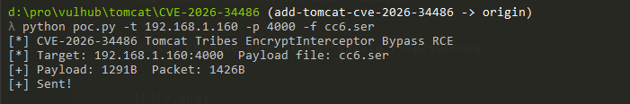
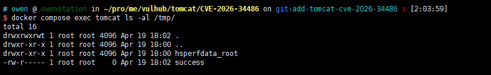

# Tomcat Tribes EncryptInterceptor绕过远程代码执行漏洞（CVE-2026-34486）

Apache Tomcat是一个广泛使用的开源Java Servlet、JavaServer Pages、Java Expression Language和WebSocket技术的实现。Tomcat Tribes是用于多个Tomcat实例之间会话复制的集群框架。

在修复CVE-2026-29146（Tribes EncryptInterceptor中的填充预言攻击漏洞）时引入了一个回归缺陷。在重构过程中，`super.messageReceived(msg)`的调用从try代码块内部移动到了外部。这意味着当接收到的消息解密失败（抛出`GeneralSecurityException`）时，异常被捕获并记录，但原始的未加密消息仍然被转发给应用程序。攻击者只需具有Tribes接收端口（默认4000）的网络访问权限，即可发送包含恶意Java反序列化payload的未加密消息，完全绕过EncryptInterceptor的保护并实现远程代码执行。该漏洞影响Apache Tomcat 9.0.116、10.1.53和11.0.20版本。

参考链接：

- <https://lists.apache.org/thread/9510k5p5zdvt9pkkgtyp85mvwxo2qrly>
- <https://www.cyberkendra.com/2026/04/apache-tomcats-security-fix-opened-door.html>
- <https://nvd.nist.gov/vuln/detail/CVE-2026-34486>

## 环境搭建

执行如下命令启动存在漏洞的Tomcat 9.0.116服务器，已启用Tribes集群和EncryptInterceptor：

```
docker compose up -d
```

服务启动后，访问`http://your-ip:8080`即可看到Tomcat默认页面。Tribes接收端口监听在4000端口。

## 漏洞复现

该漏洞利用EncryptInterceptor的绕过缺陷，向Tribes接收端口发送未加密的Java反序列化payload。payload使用Apache Commons Collections反序列化链（`ChainedTransformer`/`InvokerTransformer`）来执行任意系统命令。

首先，使用提供的`poc.py`脚本向容器内发送命令，创建一个标记文件来验证命令执行：

```
python3 poc.py your-ip 4000 "touch /tmp/success"
```



然后，通过检查容器内的文件来验证命令已被执行：

```
docker compose exec tomcat ls -la /tmp/success
```



文件`/tmp/success`存在，确认反序列化payload已被处理，命令成功执行。Tomcat日志中唯一的痕迹是一行`SEVERE: Failed to decrypt message`记录，因为EncryptInterceptor记录了解密失败但仍然转发了未加密的payload。
