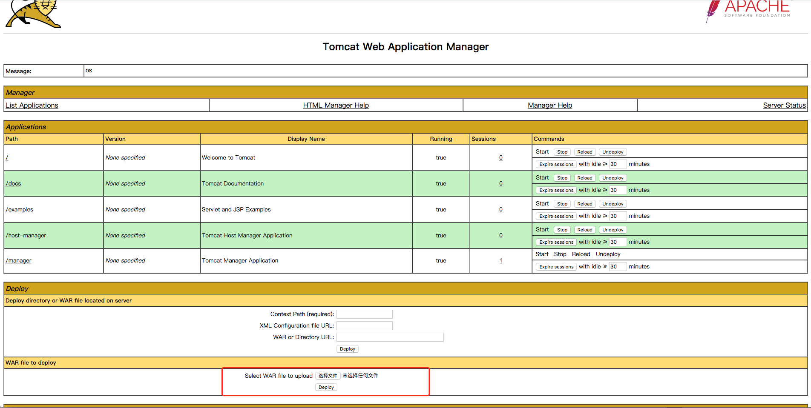

# Tomcat7+ Weak Password && Backend Getshell Vulnerability

[中文版本(Chinese version)](README.zh-cn.md)

Tomcat version: 8.0

## Introduction

Tomcat supports deploying the war files through backend, so we can directly place the webshell into the web directory. In order to access the backend, permissions are needed.

Permissions of Tomcat7+ are as follows:

 - manager（backend management）
   - manager-gui (permission of html pages)
   - manager-status (permission to view status)
   - manager-script (permission of text interface and the status permission)
   - manager-jmx (jmx permissions, and status permissions)
 - host-manager (virtual host management)
   - admin-gui (permission of html pages)
   - admin-script (permission of text interface)

To know more about the permissions, please read: http://tomcat.apache.org/tomcat-8.5-doc/manager-howto.html

Permissions of users are configured in the ` conf/tomcat-users.xml ` file:

```xml
<?xml version="1.0" encoding="UTF-8"?>
<tomcat-users xmlns="http://tomcat.apache.org/xml"
              xmlns:xsi="http://www.w3.org/2001/XMLSchema-instance"
              xsi:schemaLocation="http://tomcat.apache.org/xml tomcat-users.xsd"
              version="1.0">

    <role rolename="manager-gui"/>
    <role rolename="manager-script"/>
    <role rolename="manager-jmx"/>
    <role rolename="manager-status"/>
    <role rolename="admin-gui"/>
    <role rolename="admin-script"/>
    <user username="tomcat" password="tomcat" roles="manager-gui,manager-script,manager-jmx,manager-status,admin-gui,admin-script" />
    
</tomcat-users>
```

As can be seen, user tomcat has all of the permissions mentioned above, and the password is `tomcat`.

There are no users by default in Tomcat8 through normal installation, and the manager page only allows local IP to visit. Only if the administrator has manually modified these properties can we make an attack.

## Environment and Test

Just run：

```
docker-compose up -d
```

Open the tomcat management page `http://your-ip:8080/manager/html`，enter the weak password `tomcat:tomcat`，then access the backend：



Upload war package and then get shell directly.
