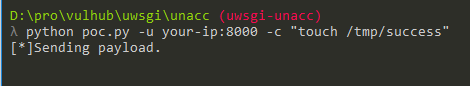
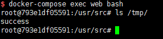

# uWSGI Unauthorized Access Vulnerability

[中文版本(Chinese version)](README.zh-cn.md)

uWSGI is a web application server, which implements protocols such as WSGI/uwsgi/http, and supports for various languages through plugins. More than an application name, uwsgi is also an exchange standard between the front-end server and the back-end application container, just like Fastcgi.

uWSGI allows configuring back-end web application dynamically through Magic Variables. If the port is exposed, attackers can construct uwsgi packets and specify the magic variable `UWSGI_FILE`, so as to execute arbitrary commands by applying `exec://` protocol.

Reference links：

- https://github.com/wofeiwo/webcgi-exploits/blob/master/python/uwsgi-rce-zh.md
- https://xz.aliyun.com/t/3512
- https://uwsgi-docs.readthedocs.io/en/latest/Vars.html

## Environment Setup

Enter the following command：

```
docker-compose up -d
```

`http://your-ip:8080` is a web application and its uwsgi is exposed to 8000 port.

## POC

Using [poc.py](poc.py)，you can run the command `python poc.py -u your-ip:8000 -c "touch /tmp/success"`：



Entering the container through `docker-compose exec web bash` ，you'll see `/tmp/success` creating successfully：


