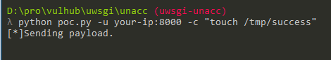
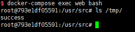

# uWSGI 未授权访问漏洞

uWSGI是一款Web应用程序服务器，它实现了WSGI、uwsgi和http等协议，并支持通过插件来运行各种语言，通常被用于运行Python WEB应用。uwsgi除了是应用容器的名称之外，它和Fastcgi之类的一样，也是前端server与后端应用容器之间的一个交流标准。目前nginx，apache也支持uwsgi协议进行代理转发请求。

uWSGI支持通过魔术变量（Magic Variables）的方式动态配置后端Web应用。如果其端口暴露在外，攻击者可以构造uwsgi数据包，并指定魔术变量`UWSGI_FILE`，运用`exec://`协议执行任意命令。

参考链接：

- https://github.com/wofeiwo/webcgi-exploits/blob/master/python/uwsgi-rce-zh.md
- https://xz.aliyun.com/t/3512
- https://uwsgi-docs.readthedocs.io/en/latest/Vars.html

## 漏洞环境

执行如下命令启动nginx+uwsgi环境：

```
docker-compose up -d
```

环境启动后，访问`http://your-ip:8080`即可查看一个Web应用，其uwsgi暴露在8000端口。

## 漏洞复现

使用[poc.py](poc.py)，执行命令`python poc.py -u your-ip:8000 -c "touch /tmp/success"`：



执行`docker-compose exec web bash`进入容器，可见`/tmp/success`已经成功执行：


