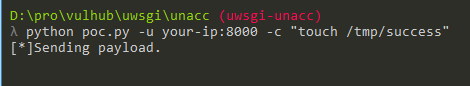
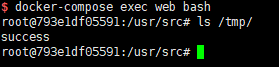

# uWSGI 未授权访问漏洞

uWSGI 是一款 Web 应用程序服务器，它实现了 WSGI、uwsgi 和 http 等协议，并支持通过插件来运行各种语言，通常被用于运行 Python WEB 应用。uwsgi 除了是应用容器的名称之外，它和 Fastcgi 之类的一样，也是前端 server 与后端应用容器之间的一个交流标准。目前 nginx，apache 也支持 uwsgi 协议进行代理转发请求。

uWSGI 支持通过魔术变量（Magic Variables）的方式动态配置后端 Web 应用。如果其端口暴露在外，攻击者可以构造 uwsgi 数据包，并指定魔术变量 `UWSGI_FILE`，运用 `exec://` 协议执行任意命令。

参考链接：

- https://github.com/wofeiwo/webcgi-exploits/blob/master/python/uwsgi-rce-zh.md
- https://xz.aliyun.com/t/3512
- https://uwsgi-docs.readthedocs.io/en/latest/Vars.html

## 漏洞环境

执行如下命令启动 nginx+uwsgi 环境：

```
docker compose up -d
```

环境启动后，访问 `http://your-ip:8080` 即可查看一个 Web 应用，其 uwsgi 暴露在 8000 端口。

## 漏洞复现

使用 [poc.py](poc.py)，执行命令 `python poc.py -u your-ip:8000 -c "touch /tmp/success"`：



执行 `docker compose exec web bash` 进入容器，可见 `/tmp/success` 已经成功执行：


