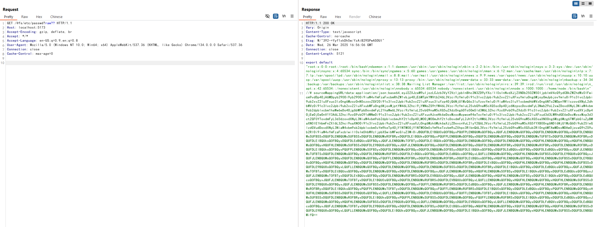

# Vite Development Server Arbitrary File Read Bypass (CVE-2025-30208)

> 화이트햇 스쿨 3기 - [함선호 (@MEspeaker)](https://github.com/MEspeaker)

 

### 요약

- Vite 6.2.3, 6.1.2, 6.0.12, 5.4.15, 4.5.10 이전 버전에서 server.fs.deny 기능 우회를 통한 임의 파일 읽기 취약점 존재
- ?raw?? 또는 ?import&raw?? 쿼리 스트링을 사용하면 서버 파일 시스템 상의 파일을 읽을 수 있음
- 이는 기존 CNVD-2022-44615 패치 우회를 통한 새로운 취약점

 

### 환경 구성 및 실행

- `docker compose up -d`를 실행하여 테스트 환경을 실행 (Vite 6.2.2)
- `http://your-ip:5173`에서 Vite 개발 환경에 접속
- 일반적인 접근 시도: `/@fs/etc/passwd` 요청 → 403 Forbidden 반환 확인
 

- 우회 접근 시도: `/@fs/etc/passwd?raw??` 를 요청하여 /etc/passwd 파일을 읽을 수 있음
- `?import&raw??` 쿼리 스트링을 사용해도 동일한 효과를 얻을 수 있음

 

### 결과

 

### 정리

해당 취약점은 개발 서버 단계에서 의도치 않게 서버 파일 시스템 정보를 노출시킬 수 있으며, 공격자가 서버 내부 파일을 읽어 민감한 정보를 탈취할 위험이 있다. 따라서 개발 환경에서도 파일 접근 제한을 철저히 관리해야 하며, Vite를 최신 버전으로 업데이트하거나 내부망 개발, 외부 차단, 프록시 필터링등의 조치를 취해야한다.
