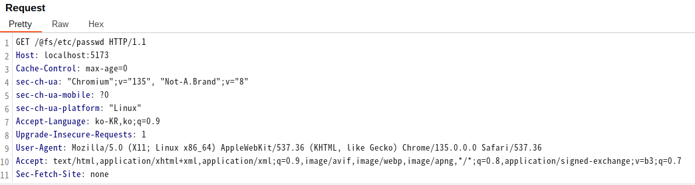
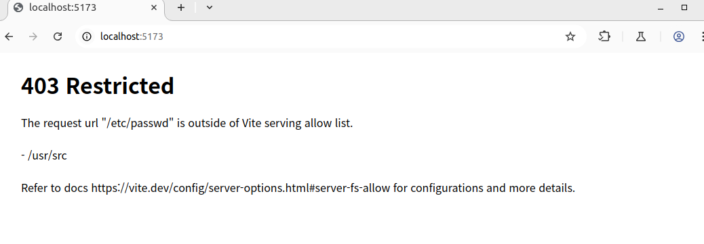

# Vite开发服务器任意文件读取漏洞绕过（CVE-2025-30208）

Vite是一个现代前端构建工具，为Web项目提供更快、更精简的开发体验。它主要由两部分组成：具有热模块替换（HMR）功能的开发服务器，以及使用Rollup打包代码的构建命令。

在Vite 6.2.3、6.1.2、6.0.12、5.4.15和4.5.10版本之前，用于限制访问Vite服务允许列表之外的文件的`server.fs.deny`功能可被绕过。通过在URL的`@fs`前缀后增加`?raw??`或`?import&raw??`，攻击者可以读取文件系统上的任意文件。

此漏洞发生的原因是，在请求处理过程中尾部分隔符（如`?`）在多个地方被移除，但在查询字符串正则表达式中没有考虑，导致安全检查被绕过。

这个漏洞是[CNVD-2022-44615](../CNVD-2022-44615/README.zh-cn.md)补丁的绕过。

参考链接：

- <https://github.com/vitejs/vite/security/advisories/GHSA-x574-m823-4x7w>
- <https://nvd.nist.gov/vuln/detail/CVE-2025-30208>

## 环境搭建

执行以下命令启动Vite 6.2.2开发服务器：

```
docker compose up -d
```

服务器启动后，可以通过访问`http://your-ip:5173`来访问 Vite 开发服务器。

> 注意：旧版本Vite的开发服务器默认端口为3000，新版本默认端口为5173，请注意区分。

## 漏洞复现

尝试使用标准的`@fs`前缀访问`/etc/passwd`，测试正常访问是否会被限制：



可见，当发送请求到`http://your-ip:5173/@fs/etc/passwd`时，你会收到403 Forbidden响应，因为这个路径在Vite服务的允许范围之外。

通过在URL后附加`?raw??`，你就可以绕过这个限制并获取文件内容：

```
curl "http://your-ip:5173/@fs/etc/passwd?raw??"
```

这个请求将会返回`/etc/passwd`文件的内容：



除了上面的Payload，你也可以使用`?import&raw??`来达到相同的效果。
