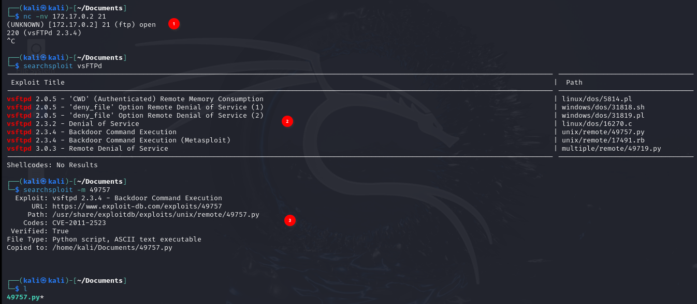
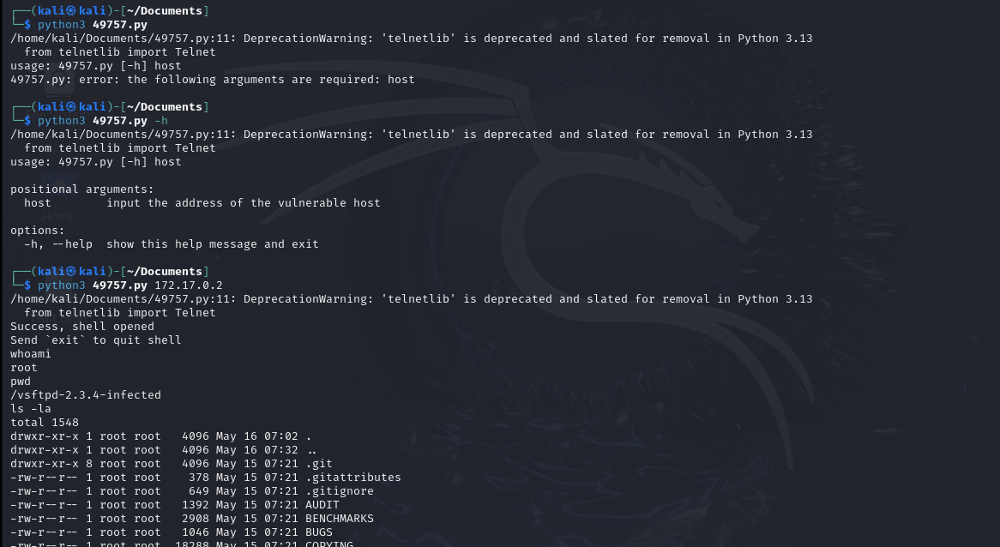

# vsftpd 2.3.4 - Backdoor Command Execution (CVE-2011-2523)
- https://cve.mitre.org/cgi-bin/cvename.cgi?name=CVE-2011-2523
- https://nvd.nist.gov/vuln/detail/CVE-2011-2523
## Setup
```bash
docker build -t vsftpd234 . 
docker run -d vsftpd234
```
## Exploiting


