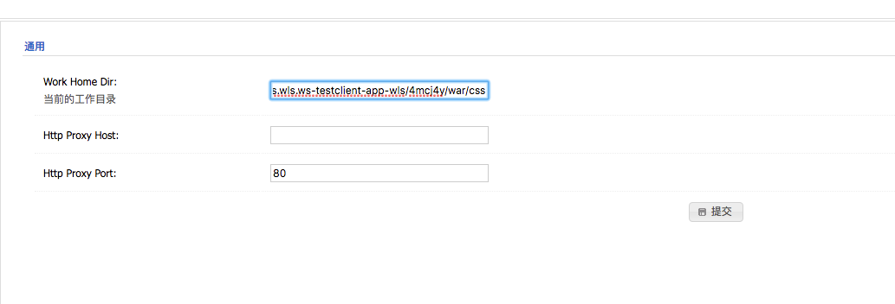
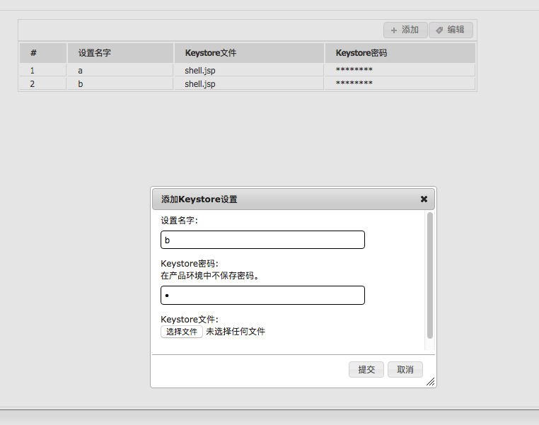
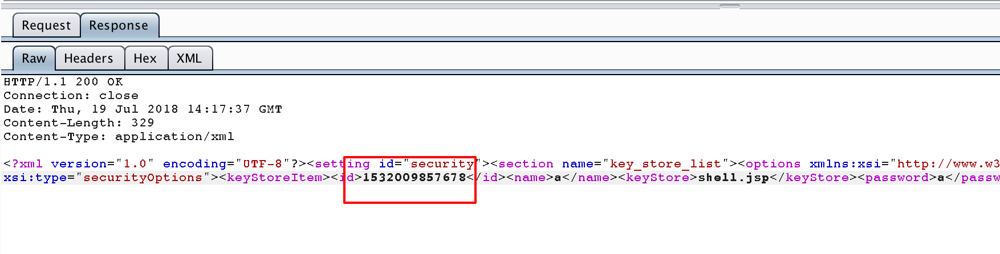
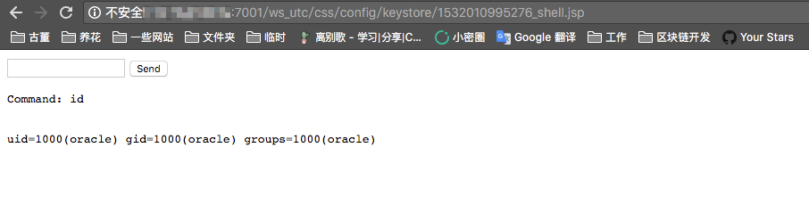

# Weblogic 任意文件上传漏洞（CVE-2018-2894）

Oracle 7月更新中，修复了Weblogic Web Service Test Page中一处任意文件上传漏洞，Web Service Test Page 在“生产模式”下默认不开启，所以该漏洞有一定限制。

利用该漏洞，可以上传任意jsp文件，进而获取服务器权限。

参考链接：

- http://www.oracle.com/technetwork/security-advisory/cpujul2018-4258247.html
- https://mp.weixin.qq.com/s/y5JGmM-aNaHcs_6P9a-gRQ
- https://xz.aliyun.com/t/2458

## 漏洞环境

执行如下命令，启动weblogic 12.2.1.3：

```
docker-compose up -d
```

环境启动后，访问`http://your-ip:7001/console`，即可看到后台登录页面。

执行`docker-compose logs | grep password`可查看管理员密码，管理员用户名为`weblogic`。

登录后台页面，点击`base_domain`的配置，在“高级”中开启“启用 Web 服务测试页”选项：


## 漏洞复现

访问`http://your-ip:7001/ws_utc/config.do`，设置Work Home Dir为`/u01/oracle/user_projects/domains/base_domain/servers/AdminServer/tmp/_WL_internal/com.oracle.webservices.wls.ws-testclient-app-wls/4mcj4y/war/css`。我将目录设置为`ws_utc`应用的静态文件css目录，访问这个目录是无需权限的，这一点很重要。



然后点击安全 -> 增加，然后上传webshell：



上传后，查看返回的数据包，其中有时间戳：



然后访问`http://your-ip:7001/ws_utc/css/config/keystore/[时间戳]_[文件名]`，即可执行webshell：


