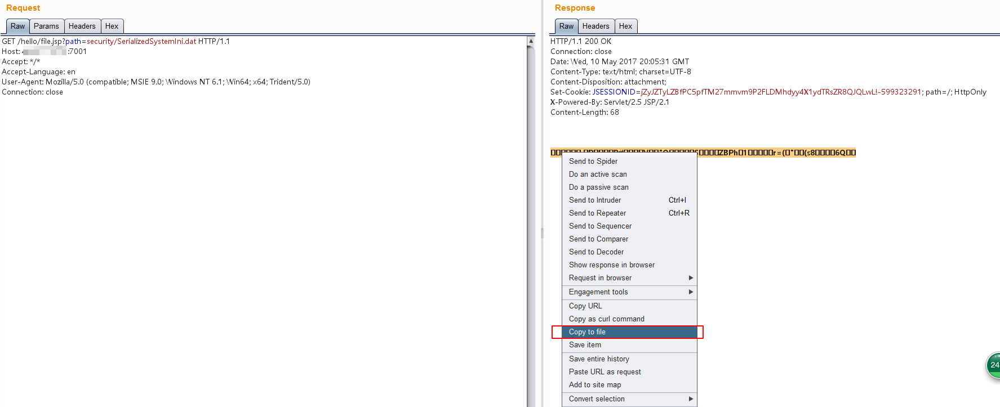
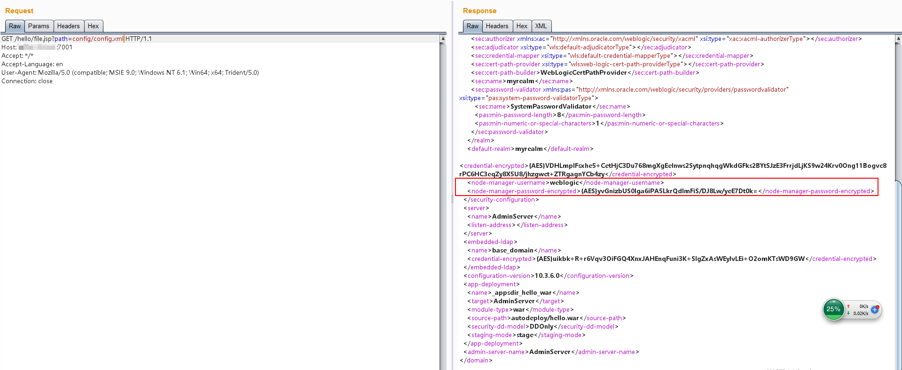
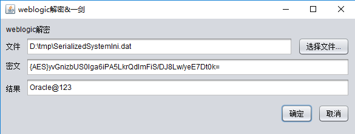
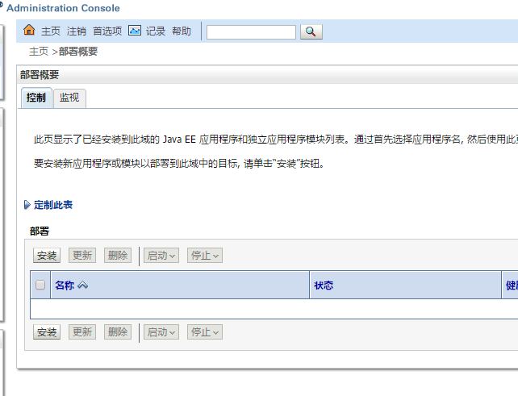
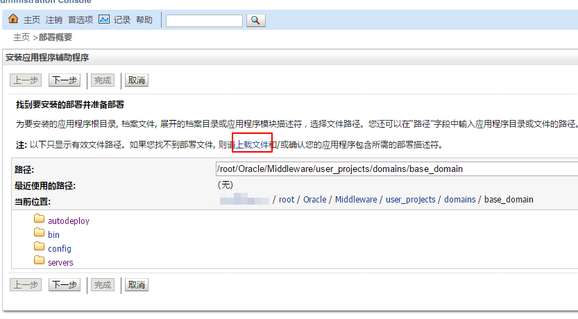
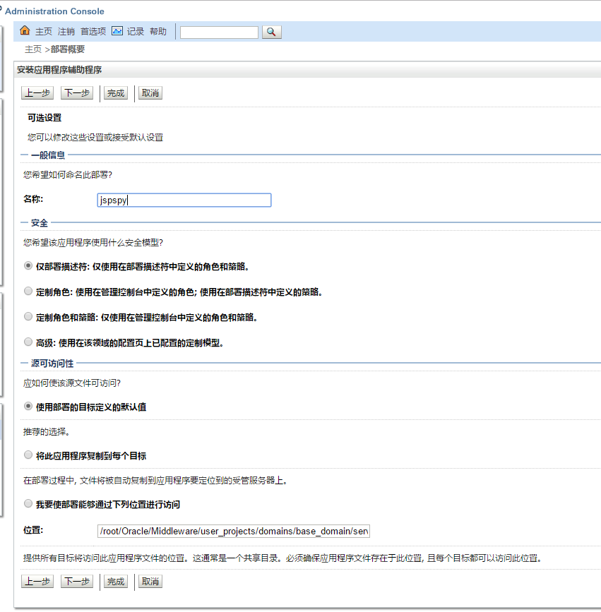
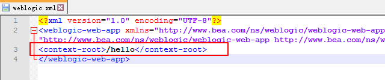
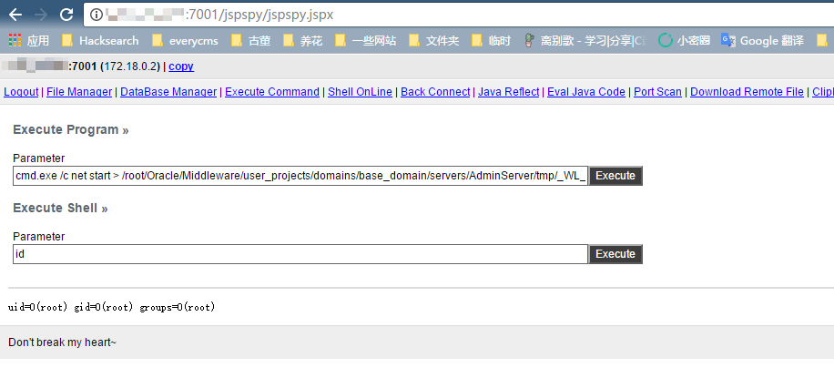

# Weblogic 常规渗透测试环境

## 测试环境

本环境模拟了一个真实的weblogic环境，其后台存在一个弱口令，并且前台存在任意文件读取漏洞。分别通过这两种漏洞，模拟对weblogic场景的渗透。

Weblogic版本：10.3.6(11g)

Java版本：1.6

启动本环境：

```
docker-compose up -d
```

## 弱口令

环境启动后，访问`http://your-ip:7001/console`，即为weblogic后台。

本环境存在弱口令：

 - weblogic
 - Oracle@123

weblogic常用弱口令： http://cirt.net/passwords?criteria=weblogic

## 任意文件读取漏洞的利用

假设不存在弱口令，如何对weblogic进行渗透？

本环境前台模拟了一个任意文件下载漏洞，访问`http://your-ip:7001/hello/file.jsp?path=/etc/passwd`可见成功读取passwd文件。那么，该漏洞如何利用？

### 读取后台用户密文与密钥文件

weblogic密码使用AES（老版本3DES）加密，对称加密可解密，只需要找到用户的密文与加密时的密钥即可。这两个文件均位于base_domain下，名为`SerializedSystemIni.dat`和`config.xml`，在本环境中为`./security/SerializedSystemIni.dat`和`./config/config.xml`（基于当前目录`/root/Oracle/Middleware/user_projects/domains/base_domain`）。

`SerializedSystemIni.dat`是一个二进制文件，所以一定要用burpsuite来读取，用浏览器直接下载可能引入一些干扰字符。在burp里选中读取到的那一串乱码，右键copy to file就可以保存成一个文件：



`config.xml`是base_domain的全局配置文件，所以乱七八糟的内容比较多，找到其中的`<node-manager-password-encrypted>`的值，即为加密后的管理员密码，不要找错了：



### 解密密文

然后使用本环境的decrypt目录下的weblogic_decrypt.jar，解密密文（或者参考这篇文章：http://cb.drops.wiki/drops/tips-349.html ，自己编译一个解密的工具）：



可见，解密后和我预设的密码一致，说明成功。

## 后台上传webshell

获取到管理员密码后，登录后台。点击左侧的部署，可见一个应用列表：



点击安装，选择“上载文件”：



上传war包。值得注意的是，我们平时tomcat用的war包不一定能够成功，你可以将你的webshell放到本项目的`web/hello.war`这个压缩包中，再上传。上传成功后点下一步。

填写应用名称：



继续一直下一步，最后点完成。

应用目录在war包中WEB-INF/weblogic.xml里指定（因为本测试环境已经使用了`/hello`这个目录，所以你要在本测试环境下部署shell，需要修改这个目录，比如修改成`/jspspy`）：



成功获取webshell：

