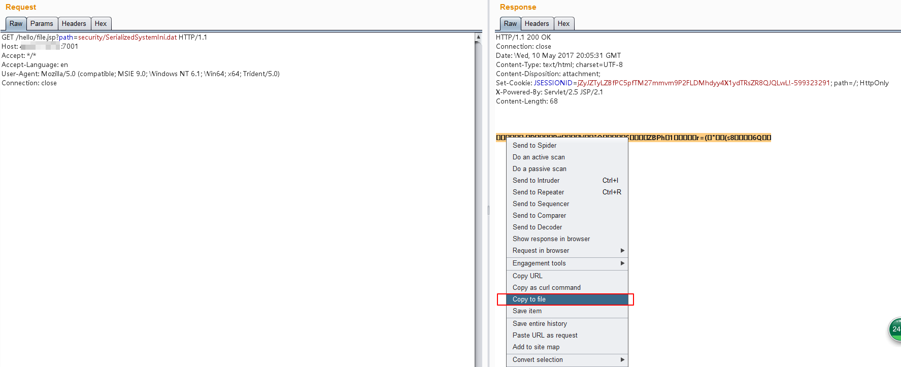
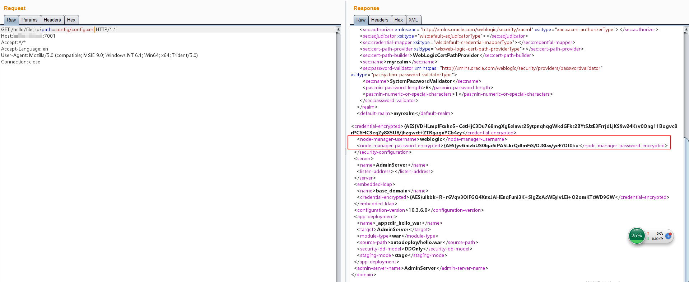
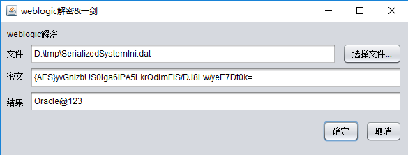
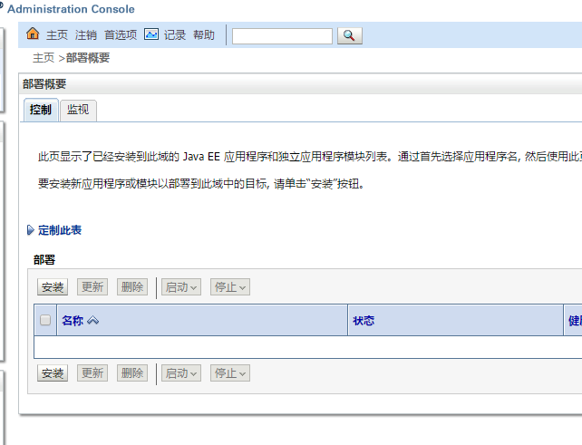
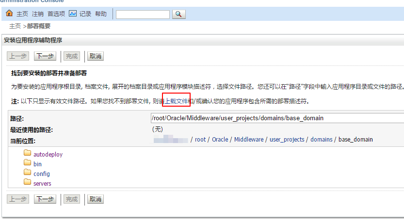
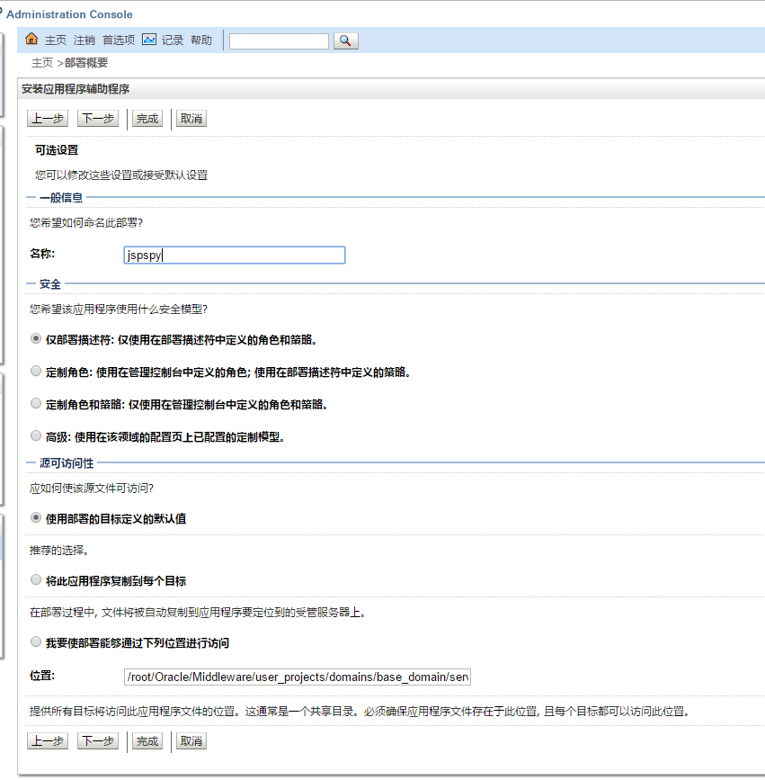
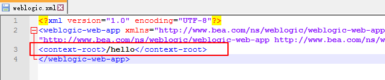
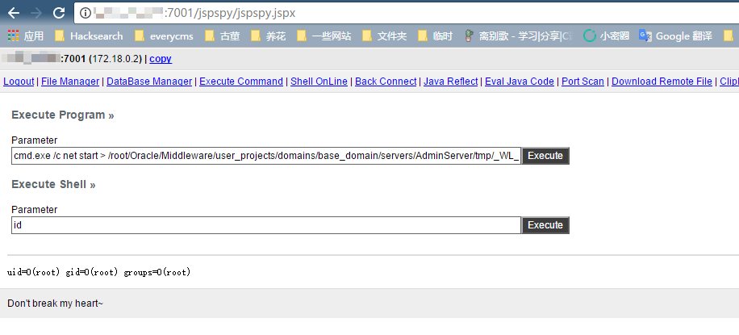

# WebLogic 弱口令、任意文件读取与远程代码执行

Oracle WebLogic Server 是一个基于 Java 的企业级应用服务器。

本环境模拟了一个真实的 WebLogic 环境，包含两个漏洞：后台管理控制台存在弱口令，以及前台存在任意文件读取漏洞。通过这两个漏洞，我们可以演示对 WebLogic 服务器的常见渗透测试场景。

## 环境搭建

执行如下命令启动 WebLogic 服务器，该服务器基于 WebLogic 10.3.6（11g）和 Java 1.6。

```
docker compose up -d
```

环境启动后，访问 `http://your-ip:7001/console` 进入 WebLogic 管理控制台。

## 漏洞复现

环境中存在以下默认凭据：

- 用户名：weblogic
- 密码：Oracle@123

更多 WebLogic 常用默认凭据可参考：<http://cirt.net/passwords?criteria=weblogic>

### 任意文件读取漏洞利用

如果没有弱口令可以利用，我们如何渗透 WebLogic 服务器？本环境模拟了一个任意文件下载漏洞。访问 `http://your-ip:7001/hello/file.jsp?path=/etc/passwd` 可以验证成功读取 passwd 文件。

要有效利用这个漏洞，我们可以通过以下步骤提取管理员密码：

### 读取后台用户密文与密钥文件

WebLogic 的密码使用 AES 加密（老版本使用 3DES）。由于这是对称加密，如果我们能获得密文和加密密钥，就可以解密密码。这两个文件位于 base_domain 目录下：

- `SerializedSystemIni.dat`：加密密钥文件
- `config.xml`：包含加密密码的配置文件

在本环境中，这些文件位于：

- `./security/SerializedSystemIni.dat`
- `./config/config.xml`

（相对于 `/root/Oracle/Middleware/user_projects/domains/base_domain` 目录）

下载 `SerializedSystemIni.dat` 时，必须使用 Burp Suite，因为这是二进制文件。直接用浏览器下载可能会引入干扰字符。在 Burp Suite 中，选中二进制内容并使用"Copy to File"功能正确保存：



在 `config.xml` 中，找到 `<node-manager-password-encrypted>` 值，这里包含了加密后的管理员密码：



### 解密密文

使用环境中 decrypt 目录下的 `weblogic_decrypt.jar` 工具解密密文。如需了解如何构建自己的解密工具，可参考：<http://cb.drops.wiki/drops/tips-349.html>



解密后的密码与预设密码一致，证明利用成功。

### 部署 WebShell

获取管理员凭据后，登录管理控制台。点击左侧导航栏中的"部署"查看应用列表：



点击"安装"并选择"上传文件"：



上传 WAR 包。注意，标准的 Tomcat WAR 文件可能无法正常工作。你可以使用本项目中的 `web/hello.war` 包作为模板。上传后点击"下一步"。

输入应用名称：



继续完成剩余步骤，最后点击"完成"。

应用路径在 WAR 包中的 `WEB-INF/weblogic.xml` 文件中指定。由于测试环境已经使用了 `/hello` 路径，部署 shell 时需要修改这个路径（例如改为 `/jspspy`）：



成功访问 webshell：


