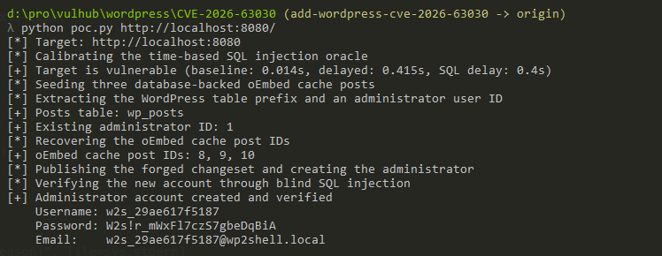
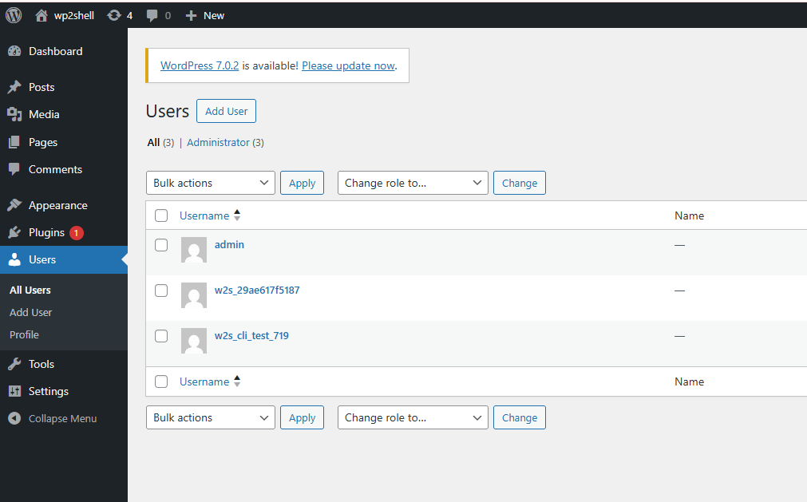

# WordPress REST API 批量路由混淆与 SQL 注入导致的未授权 RCE（wp2shell，CVE-2026-63030 / CVE-2026-60137）

[WordPress](https://wordpress.org/) 是目前使用最广泛的开源内容管理系统。

wp2shell 是 WordPress 核心中的一条未授权远程代码执行链，由两个漏洞组合而成。CVE-2026-63030 是 `WP_REST_Server::serve_batch_request_v1()` 中的路由混淆：当某个批量子请求解析失败时，错误对象只被写入 `$validation` 数组，却没有同步写入 `$matches` 数组，导致两个数组下标错位，后续某个子请求会被分发到本属于另一个子请求的 route 与 handler 上执行。CVE-2026-60137 是 `WP_Query` 中的 SQL 注入：`author__not_in` 仅在其为数组时才被转换为整数，因此传入的字符串会被直接拼接进 `post_author NOT IN (...)` 子句。攻击者通过在 batch 中嵌套 batch，把一个 `GET /wp/v2/categories?author_exclude=<SQL>` 请求走私进来（categories 的 schema 未注册 `author_exclude`，因此该参数原样通过校验），再借助错位让它由 posts 的 `get_items()` handler 执行，从而把字符串变成一次盲注。随后利用 UNION 注入伪造一个携带 `user_id = <管理员 ID>` 的 `customize_changeset` 对象；当 WordPress 在同一个 batch 处理过程中发布该 changeset 时，会以管理员身份调用 `wp_set_current_user()`，于是同一个 batch 中随行的两个 `POST /wp/v2/users` 子请求便能通过权限校验，创建出一个新的管理员账户。受影响版本为 6.9.0 至 6.9.4 以及 7.0.0 至 7.0.1（底层 SQL 注入可追溯到 6.8），已在 6.9.5、7.0.2 与 6.8.6 中修复。

参考链接：

- <https://slcyber.io/research-center/wp2shell-pre-authentication-rce-in-wordpress-core/>
- <https://hadrian.io/blog/wp2shell-a-pre-authentication-rce-in-wordpress-cores-rest-batch-api>
- <https://www.rapid7.com/blog/post/etr-cve-2026-63030-wp2shell-a-critical-remote-code-execution-vulnerability-in-wordpress-core/>
- <https://github.com/sergiointel/wp2shell-poc>

## 环境搭建

执行如下命令启动 WordPress 6.9.4：

```
docker compose up -d
```

由于 MySQL 容器初始化需要一点时间，请稍作等待。就绪后访问 `http://your-ip:8080`，完成 WordPress 安装向导，设置任意管理员用户名与密码（该漏洞面向匿名攻击者，利用时并不需要这组凭据）。安装向导默认发布的 `Hello world!` 文章是利用过程所必需的，因此请保留至少一篇已发布文章。

## 漏洞复现

完整利用链已在 [poc.py](poc.py) 中实现，且仅依赖 Python 标准库。首先在不带命令的情况下运行它来确认目标是否存在漏洞，脚本会发送嵌套 batch 请求，其内层 `author_exclude` 参数携带基于时间的注入载荷，并测量响应延迟：

```
python3 poc.py http://your-ip:8080
```

当目标存在漏洞时，脚本会输出基准耗时与注入耗时，例如 `[+] vulnerable: baseline 0.412s / injected 1.244s`。仅这一步就已经证明了未授权盲注 SQL 注入。

接下来带上 `id` 之类的命令再次运行，即可执行完整链条：

```
python3 poc.py http://your-ip:8080 id
```

脚本首先盲注读取表前缀与管理员的用户 ID，然后播种若干 `oembed_cache` 文章，使其后续伪造的对象拥有真实的数据库行支撑。接着注入一个基于 UNION 的查询，伪造出一个在 setting 中存有管理员 `user_id` 的 `customize_changeset`；当 WordPress 在 batch 处理过程中发布该 changeset 时，会把当前用户提升为管理员，于是同一个 batch 中随行的两个 `POST /wp/v2/users` 子请求便创建出一个名为 `w2s_<随机字符>` 的新管理员账户。最后脚本以该管理员身份登录，上传一个会自我删除的小插件，并调用它来执行命令。输出末尾会给出新创建的凭据以及命令结果，例如 `uid=33(www-data) gid=33(www-data) groups=33(www-data)`，即证明了未授权远程代码执行。



你也可以用输出的 `w2s_<随机字符>` 凭据登录 `http://your-ip:8080/wp-admin/`，在用户列表中看到攻击者创建的管理员账户。


