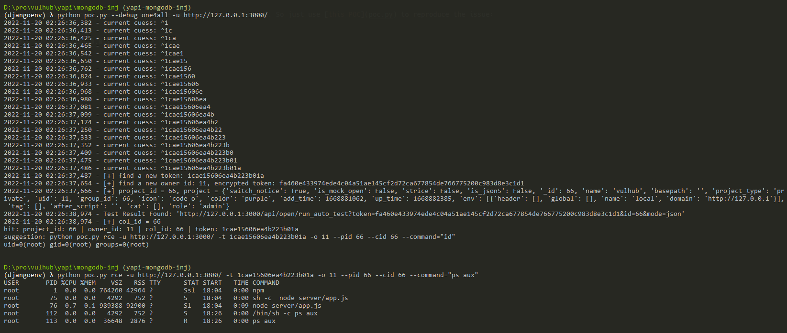

# YApi NoSQL 注入导致远程命令执行漏洞

YApi 是一个 API 管理工具。在其 1.12.0 版本之前，存在一处 NoSQL 注入漏洞，通过该漏洞攻击者可以窃取项目 Token，并利用这个 Token 执行任意 Mock 脚本，获取服务器权限。

参考链接：

- <https://github.com/YMFE/yapi/commit/59bade3a8a43e7db077d38a4b0c7c584f30ddf8c>

## 漏洞环境

执行如下命令启动一个 YApi v1.10.2 服务：

```
docker compose up -d
```

环境启动后，访问 `http://your-ip:3000` 即可看到 YApi 首页。

## 漏洞复现

本漏洞的利用需要 YApi 应用中至少存在一个项目与相关数据，否则无法利用。Vulhub 环境中的 YApi 是一个即开即用、包含测试数据的服务器，所以可以直接进行漏洞复现。

使用 [这个 POC](poc.py) 来复现漏洞：

```
python poc.py --debug one4all -u http://127.0.0.1:3000/
```


